# Report W3
## Canary
Canary là một giá trị bí mật được chương trình push vào stack nằm ở ngay sau con trỏ base pointer. Mode này sinh ra để đảm bảo rằng hệ thống không bị buffer overflow. Khi chuẩn bị trả về saved base pointer và return address chương trình sẽ kiểm tra canary trước và hiện tại, nếu có sự sai khác dù chỉ 1 bit, chương trình sẽ thoát ngay lập tức.
|buf|
|:-|
|canary|
|ebp|
|ret|

Để bypass cái này chỉ có cách lấy được giá trị của nó thôi (brute force chẳng hạn)  =))

## NX (NX bit - Non-Executable Stack)

Công nghệ dùng để phân chia sự sử dụng của bộ nhớ, hoặc là để lưu các lệnh của hệ thống, hoặc là để lưu dữ liệu. NX bit sẽ đánh dấu một số vùng nhớ nào đó trên bộ nhớ là non-excutable. Hệ thống sẽ từ chối thực thi mọi dòng lệnh được lưu trong vùng này và khiến shellcode của ta bất hoạt.
Bypass bằng cách sử dụng kỹ thuật ret2libc. Do libc không thể nằm trong vùng readonly nên có thể tận dụng các hàm của nó thay cho shellcode, chẳng hạn như system('/bin/sh')

## PIE (Position Independent Executable)

Khi mode này được bật, mỗi khi chương trình thực thi, nó sẽ được load vào 1 vùng nhớ random trên bộ nhớ ảo (virtual memory). Khiến ta rất khó để lấy được các địa chỉ, vì nó luôn thay đổi liên tục, không cố định, khó khăn khi sử dụng kỹ thuật ROP.
Nhưng vẫn không đến nỗi no hope với mode này. Tuy các địa chỉ luôn thay đổi random mỗi khi chạy, nhưng khoảng cách của các thành phần vẫn không thay đổi (khoảng các giữa các hàm với nhau, các biến với nhau ...). Nếu ta có thể leak ra được một địa chỉ nào đó thì có thể thông qua khoảng cách này để xác định các thành phần còn lại.

## RELRO (relocation read_only)
### GOT (global offset table) & PLT (prosedure linkage table)

File binary ELF format tồn tại hai thành phần không thể thiếu, đó là got và plt. PLT là một vùng nhớ read only trong file elf chứa các symbols cần thiết của các hàm trong libc. Plt sẽ gọi trình liên kết động để tìm ra địa chỉ thực của hàm được gọi đến nằm trong libc. Got là một vùng read_writeable dùng để lưu các địa chỉ của các symbol được nói ở bên trên. Khi lần đầu tiên hàm được gọi, got lúc này sẽ chứa con trỏ trỏ về plt, plt sẽ tìm địa chỉ thực của hàm đó rồi ghi lại vào got, từ lần sau trong got sẽ có sẵn địa chỉ thực của hàm đấy luôn. Có lẽ do plt mất quá nhiều thời gian để resolve địa chỉ của hàm nên mới sinh ra bảng got để tiện cho việc truy xuất.

    .got : đây chính là global offset table là nơi lưu các giá trị của hàm sau khi được plt và linker tìm kiếm
    .plt : là prosedure linked table, có chức năng tìm kiếm địa chỉ thực tế của các hàm trong phần .got.plt và nhảy đến đúng địa chỉ đấy. Hoặc là sẽ kích hoạt các dòng lệnh của linker để tìm kiếm địa chỉ thực của hàm được gọi
    .got.plt : là một phần dữ liệu của .got. Là phần got của plt, chứa các địa chỉ target sau khi đã được tìm ra địa chỉ thực, hoặc là chứa địa chỉ back lại plt để tìm kiếm nếu được gọi lần đầu. (sau khi được tìm kiếm thành công thì địa chỉ sẽ nằm ở đây trước khi ghi lại vào .got ???)

Đến đây ta có thể thấy được nhược điểm của bảng này: got là một bảng con trỏ hàm được cấu tạo từ nhiều phần dữ liệu khác nhau, vì cần phải được gọi bởi chương trình nên nó phải được lưu ở địa chỉ tĩnh nào đó để tiện cho việc truy xuất. Và cuối cùng, quan trọng nhất got là vùng writable. Chính vì lý do này mà RELRO được ra đời để ngăn chặn got bị overwrite. Có 2 loại chính:

**Partial RELRO**
Ở mode này, phần non_plt của .got là read only nhưng phần .got.plt vẫn writable. Hầu như mode này không ảnh hưởng đến việc .got bị overwrite.

**Full RELRO**
Cả .got và .got.plt đều read only, hoàn toàn tránh khỏi got overwrite attack.
Khi Full RELRO được bật thì got đã không thể ghi được, hãy kiểm tra các mode khác để tìm cách khai thác khác.

## Fortify (FORTIFY_SOURCE)
Fortify có thể phát hiện và ngăn chặn được buffer overflow của các hàm có phát hiện khuyết điểm như memcpy, memset, stpcpy, strcpy...
VD:
```c
char buf[3]
strcpy(buf, 'hi')
// Fortify sẽ kiểm tra và thấy rằng đoạn code này hoàn toàn hợp lệ khi mảng buf có 3 byte được copy với 'hi' + null byte hoàn toàn không gây ra bof nên sẽ cho strcpy thực thi như bình thường.
int n
strcpy(buf, n)
// ở đây Fortify không biết buf sẽ copy bao nhiêu byte vì n không cho trước. nên nó sẽ thay thế strcpy bằng __strcpy_chk. __strcpy_chk sẽ kiểm tra nếu có bof xảy ra, gọi __chk_fail và báo cho chương trình thông qua message gửi tới stderr
```

## ASLR (Address Space Layout Randomization)
Là một cơ chế bảo vệ bằng cách ngẫu nhiên hóa địa chỉ bộ nhớ của các tiến trình, ngăn chặn việc tấn công thông qua vị trí của application memory map. Không giống với PIE, trong khi PIE load chương trình vào random virtual mem và các offset của các thành phần trong nó vẫn được giữ nguyên, ASLR lúc chạy sẽ load chương trình vào virtual mem và thư viện sẽ được load vào vị trí khác(mỗi thứ 1 nơi :))), offset giữa hai vị trí này là random . Nên các kỹ thuật bof, ROP hơi khó khăn hơn một chút. Nhưng mà ASLR chỉ có thể ngăn chặn việc vuln bị exloit hoàn toàn không thể loại bỏ được vuln nên có thể vẫn còn cách khác để exploit. 
Vì offset giữa các phần tử trong libc vẫn không thay đổi nên nếu có thể leak ra được 1 địa chỉ trong got hoặc plt ta có thể tận dụng được hàm nào đấy trong libc để tạo shell (vd system('/bin/sh'))

## Stack frame 
Stack là một phân đoạn của bộ nhớ có thể thay đổi kích thước và tồn tại trong suốt quá trình thực thi của chương trình. Một stack frame sẽ được cung cấp cho một funtion mỗi khi được gọi tới. Nó chứa các local variable và các argument cùng với một return address. Stack frame sẽ được thêm vào khung stack khi hàm được gọi và được loại bỏ khi hàm trả về hoặc exit. Stack hoạt động theo cơ chế lifo. Stack ở hệ thống 32bit và 64 bit cơ bản đều giống nhau, khác nhau chỉ là độ lớn các thanh ghi và ô nhớ: 32 bit chỉ có 4byte trong khi 64 bit gấp đôi. Và khi một hàm được gọi ở hệ thống 32 bit, các arg của nó sẽ được push vào stack, còn 64 bit sẽ lưu các arg trong các thanh ghi

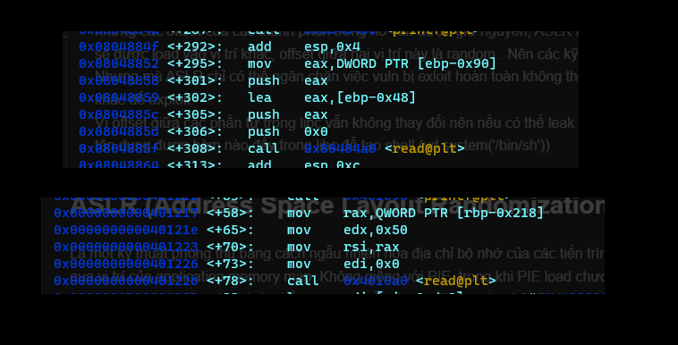
 
Để tiện phân tích thì mình nên tạo 1 chương trình đơn giản để debug

```c
#include <stdio.h>
int add(int a, int b){
int x = a;
int y = b;
int z = x + y;

return z;
}

int main(){
int a = 2;
int b = 1;
int c = add(a, b);
return 0;
}

```
compile bằng gcc và bật mode debug lên: 

    $ gcc -o debug debug.c -g

Trước khi gọi, chương trình sẽ phải push các arg của hàm đó vào trước theo thứ tự bị đảo ngược. Có thể nhìn thấy trong hình add nhận 2 tham số kiểu số nguyên và đây là chương trình 64bit nên 2 tham số đó sẽ được lưu trong rdi và rsi

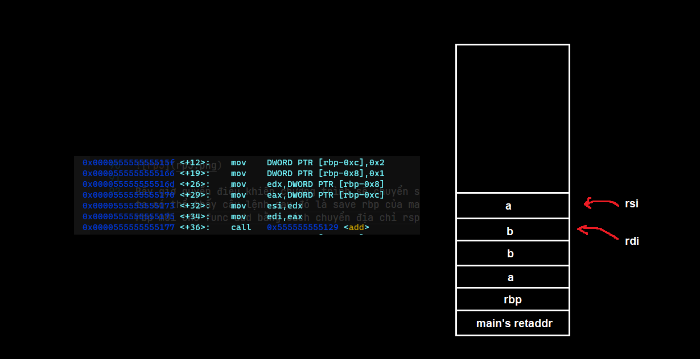

Khi một hàm được gọi, đầu tiên là sẽ phải xác định địa chỉ trả về (return address). Lúc main call add thì câu lệnh ngay sau lệnh gọi sẽ là địa chỉ trả về của call 

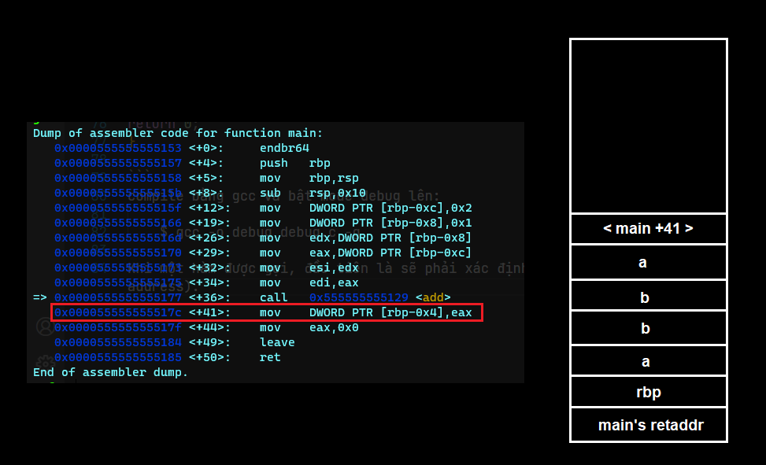

lúc này stack sẽ push địa chỉ trả về của add vào

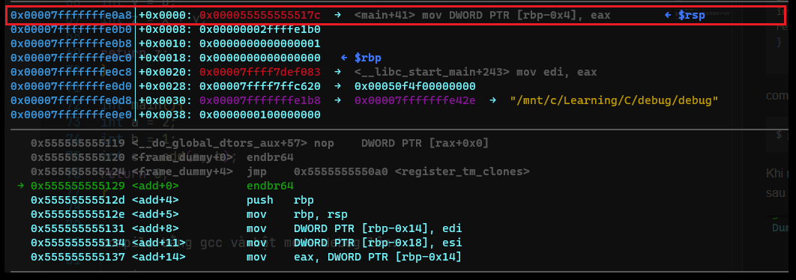

Bây giờ quyền điều khiển chương trình sẽ chuyển sang hàm add. Tiếp theo ta có thể thấy câu lệnh sau đó là save rbp của main bằng lệnh push và tạo rbp mới cho func add bằng cách chuyển địa chỉ rsp đang trỏ vào rbp

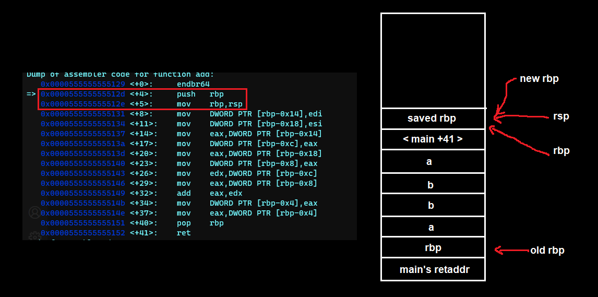

Chương trình sẽ lưu các tham số vào stack

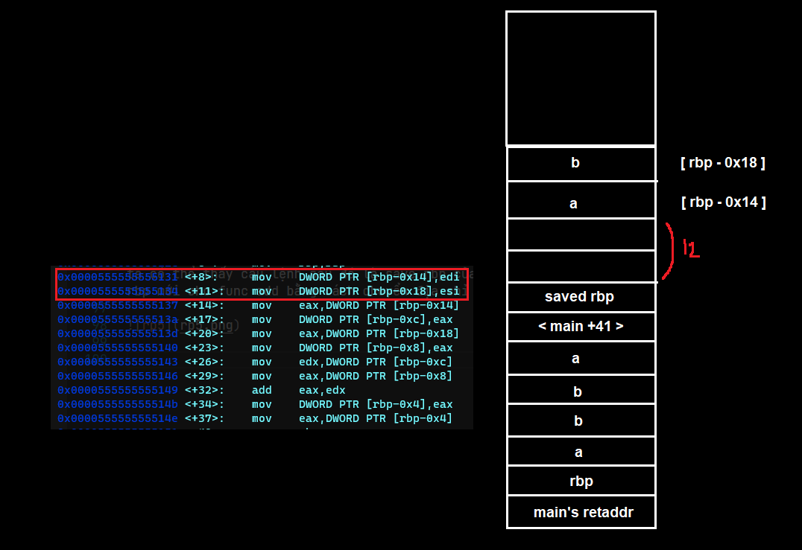
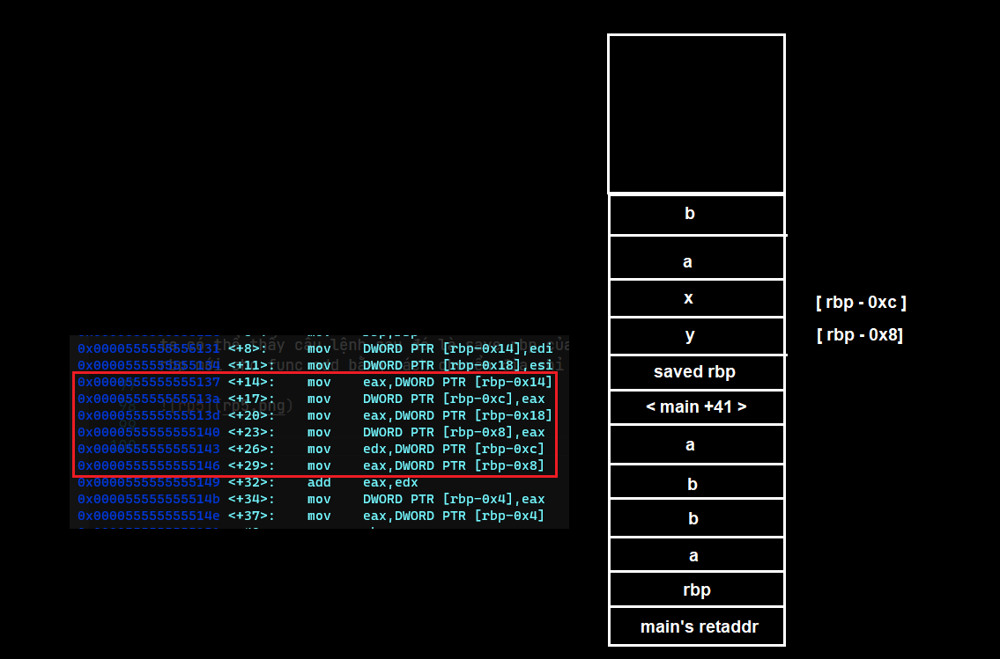

Trông lộn xộn quá =)) mình cũng k hiểu sao nó lại như này nữa
Tiếp theo sẽ đến câu lệnh add và lưu kết quả vào rax để chuẩn bị trả về main

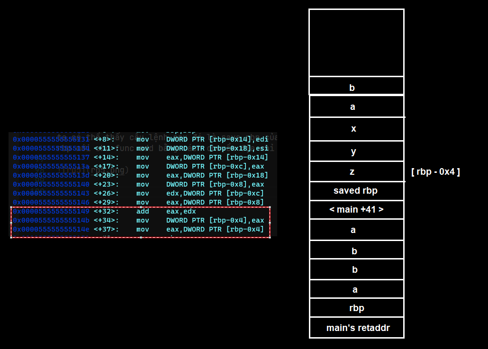

Sau đó là lệnh pop rbp

    0x0000555555555151 <+40>:    pop    rbp

Lệnh này có chức năng giống với lệnh leave thường gặp. Chương trình sẽ tiến hành pop rbp đã lưu trong stack ra rồi lưu vào con trỏ rbp
Trước khi pop: 

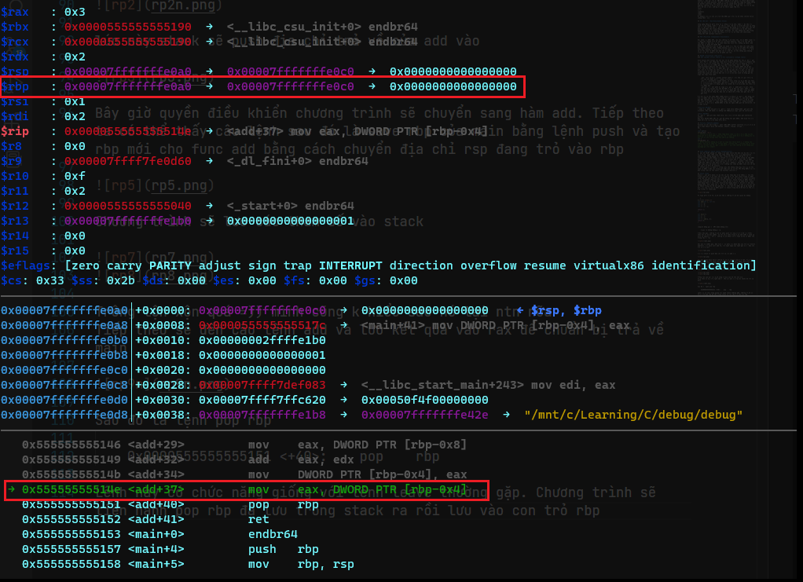

Sau đó: 
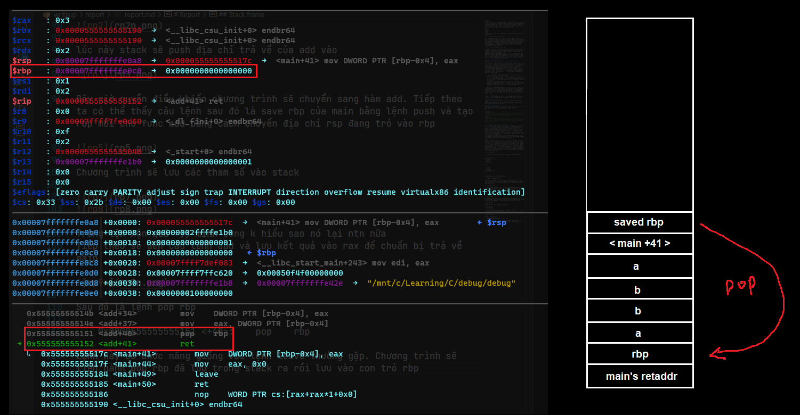

Tiếp theo, ở đỉnh stack lúc này đang chứa địa chỉ trả về của add, chương trình sẽ pop giá trị này ra rồi lưu vào con trỏ lệnh rip

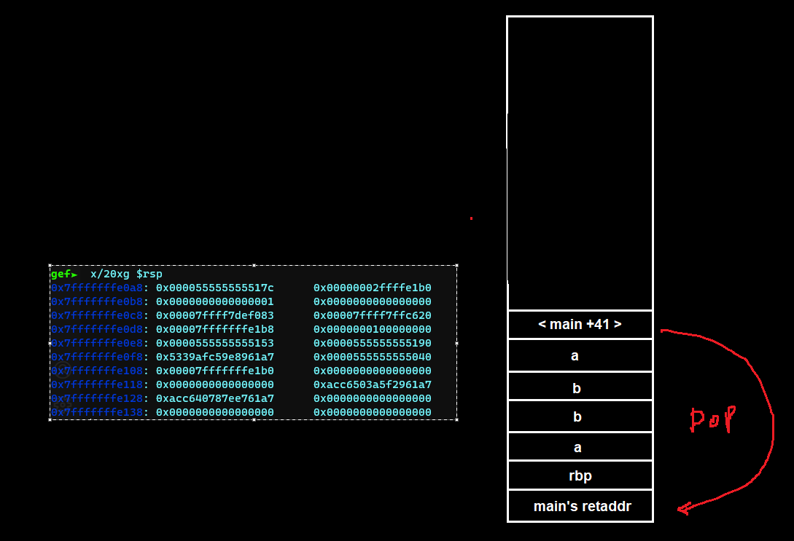

Chương trình sẽ chuyển lại luồng điều khiển về main rồi thực hiện tiếp câu lệnh lưu trong rip. Stack frame của func add sẽ bị hủy

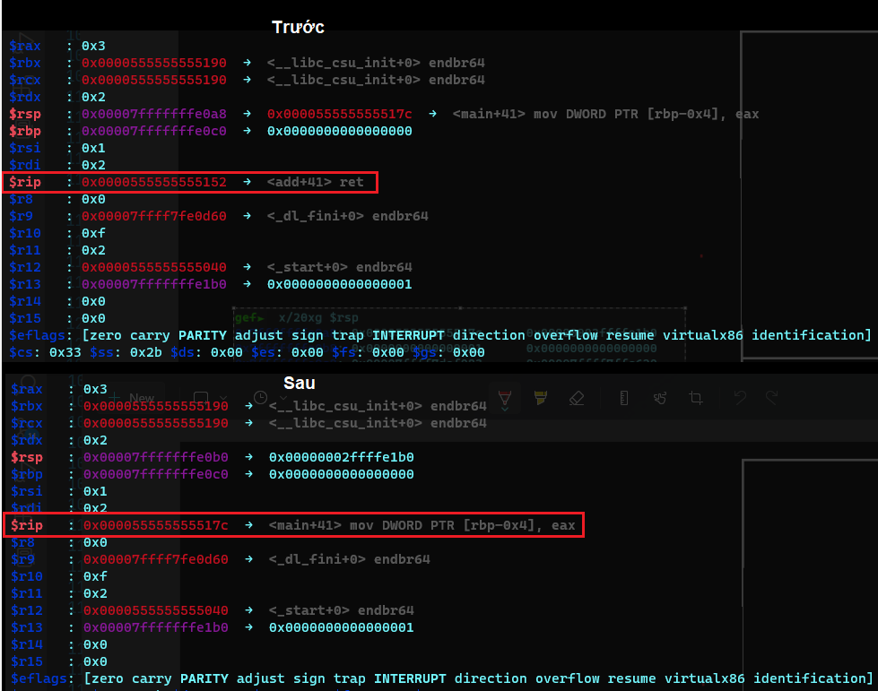